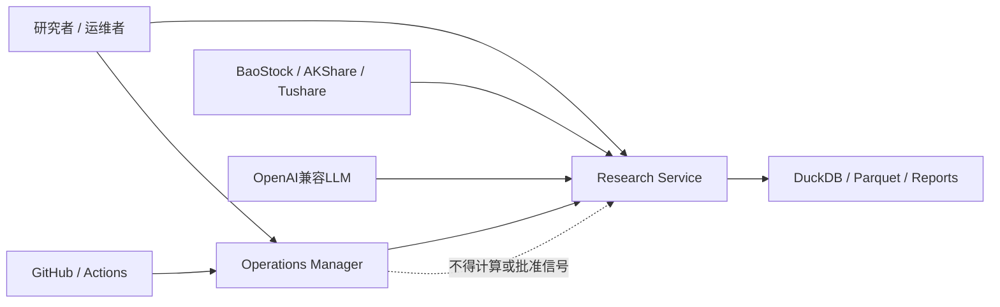
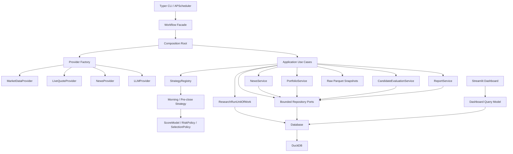
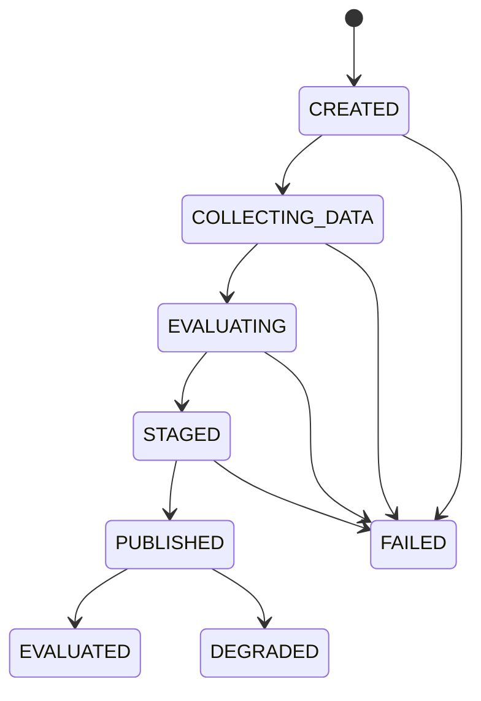

# KFCQuant 技术架构总结与演进路线

> 本文档是 KFCQuant 的长期工程基线，用于回答四个问题：系统现在是什么、为什么这样设计、接下来向哪里演进、每一阶段做到什么程度才算完成。

## 0. 文档控制

| 项目 | 当前值 |
|---|---|
| 文档状态 | Active / 长期维护 |
| 首次建立 | 2026-08-15 |
| 最近复核 | 2026-08-19 |
| 项目版本基线 | `0.2.0` |
| 源码基线 | `86f352c`（M6-A实现与本文更新位于当前未提交工作区） |
| 适用范围 | Research Service、Operations Manager、数据与部署基础设施 |
| 目标读者 | 项目维护者、策略开发者、代码审查者、部署维护者 |
| 领域语言 | 以根目录 `CONTEXT.md` 为准 |
| 路线状态来源 | 本文第 12、13 节 |

相关基线文档：

- [项目说明与运行手册](../README.md)
- [领域语言](../CONTEXT.md)
- [项目与依赖声明](../pyproject.toml)
- [生产依赖锁](../requirements.lock)
- [持续集成工作流](../.github/workflows/ci-release.yml)

### 0.1 文档职责

本文档负责：

- 记录当前已实现架构，而不是只描述理想架构；
- 说明关键质量属性、边界和依赖方向；
- 维护架构风险、技术债和演进优先级；
- 把宏观方向拆成可独立验收的工作包；
- 用明确证据记录里程碑完成程度；
- 为后续 ADR、迁移、策略实验和发布决策提供索引。

本文档不负责：

- 取代 `README.md` 的安装和使用说明；
- 取代 `CONTEXT.md` 的领域词汇定义；
- 记录某一策略的全部研究假设和参数；
- 取代数据库迁移文件、API契约或运行手册；
- 将未来路线描述成已经具备的能力。

### 0.2 更新触发条件

发生下列任一事件时，必须在同一个变更中复核本文档：

1. 新增、删除或重命名核心模块；
2. 新增策略、数据源、账户或执行模式；
3. 修改 Signal Run、订单、持仓、评估或数据快照模型；
4. 修改调度窗口、数据新鲜度门禁或降级规则；
5. 修改数据库、迁移方式、并发模型或部署拓扑；
6. 完成或调整本文路线图中的工作包；
7. 发生需要改变架构假设的生产事故；
8. 每个正式版本发布前，至少进行一次例行复核。

### 0.3 状态词汇

本文统一使用以下状态，禁止用“差不多”“基本完成”等模糊表述：

| 状态 | 含义 |
|---|---|
| `NOT_STARTED` | 尚未开始，没有可验收产物 |
| `PLANNED` | 范围和验收条件已明确，尚未编码 |
| `IN_PROGRESS` | 已有实现，但尚未满足全部验收条件 |
| `BLOCKED` | 存在明确阻塞条件，必须记录原因 |
| `DONE` | 全部验收条件通过且证据已登记 |
| `DEFERRED` | 主动延后，必须记录重新评估条件 |
| `REJECTED` | 经决策不再实施，必须记录原因或ADR |

路线进度不按主观百分比填写，统一按已验收工作点计算：

```text
里程碑完成度 = DONE 工作点之和 / 里程碑全部工作点之和
```

工作点只表达相对复杂度：`1`为小、`2`为中小、`3`为中、`5`为大，不代表工时承诺。

---

## 1. 执行摘要

KFCQuant 当前是一个面向个人使用、强调可审计和安全降级的 A 股双时段研究系统。它在 08:30 产生 Morning Watchlist，在 14:40 产生 Pre-close Entry List，维护影子组合并做前向评估；它不连接券商，也不执行真实交易。

当前最准确的架构定性是：

> 一个以 Python、DuckDB 和 Parquet 为基础，采用单一写入者模型，并将 Research Service 与 Operations Manager 分离的单机模块化单体。

当前工程能力分布并不均衡：

| 能力 | 成熟度 | 结论 |
|---|---:|---|
| 运行安全与失败关闭 | 较高 | 数据不新鲜、公告异常和窗口不符时能够禁止影子买单 |
| 数据源隔离 | 高 | Provider已有Protocol、Factory、版本化表级Schema与共享离线契约；Workflow在持久化和订单规划前复核边界 |
| 影子组合一致性 | 中高 | 买卖成交具备事务和幂等保护 |
| 部署与回滚 | 较高 | 具备CI验证、备份、健康检查和自动回滚 |
| 单策略可维护性 | 中高 | 股票池、特征、技术评分、资讯风险和选择Policy已分离并独立测试 |
| 应用与持久化边界 | 高 | Workflow已拆为独立应用用例；领域服务只接收上下文最小Repository能力；Composition Root集中组装依赖，Dashboard只消费显式只读查询模型 |
| 多策略演进 | 较高 | Strategy契约、Registry、归属、参数身份与Golden Snapshot回归基线已建立 |
| 严格可复现性 | 较高 | Published Run已有完整版本清单、精确输入快照、Hash和上游批次引用；风险事件可继续定位Prompt与LLM调用版本 |
| 故障恢复 | 高 | Signal发布已整体原子化；Job具备续租、竞争隔离、过期回收和迟到写入隔离 |
| 可观测性 | 中高 | JSON关联日志、类型化运行指标、本地审计、去重告警与可选Webhook已建立；独立外部心跳探针和生产告警接收端仍需部署验证 |
| 回放与实验 | 高 | Replay、实时共核和隔离历史Simulator已形成闭环；Experiment以同一内容寻址数据集比较基线/候选，记录声明的验收标准、指标、数据质量、结论和可复算Hash |

最重要的长期演进支点是：

1. 让 Strategy 成为一等架构对象；
2. 让每次 Research Run 拥有完整、不可变的运行清单；
3. 让一次Signal发布成为原子、幂等、可恢复的事务；
4. 让实时运行与历史回放复用同一个策略内核；
5. 保持模块化单体，避免在规模需求出现前引入分布式复杂度。

---

## 2. 系统目标、约束与质量属性

### 2.1 系统目标

- 在明确的信息截止时间内产生可审计的研究信号；
- 对行情、公告、新闻和模型输出进行保守风险控制；
- 维护不接券商的影子组合并保存完整订单和成交记录；
- 通过前向数据评估信号与组合表现；
- 让数据源、策略版本、运行状态和发布版本可观察；
- 在个人可承担的运维复杂度内长期稳定运行。

### 2.2 明确约束

- 当前不连接真实券商，不接受自动实盘执行需求；
- 默认面向单用户、单账户、单机部署；
- 当前数据源包含免费公开源，其稳定性和时间精度有限；
- DuckDB采用单一worker写入，网页只读；
- 资讯LLM不能修改确定性技术评分；
- 所有信号必须遵守信息截止边界，禁止未来数据泄漏；
- 不以历史回测或影子结果承诺未来收益。

### 2.3 质量属性优先级

遇到设计冲突时，按下列顺序取舍：

1. **安全性**：不满足数据与资讯门禁时不创建影子买单；
2. **时间正确性**：任何输入都必须满足Signal Run的信息截止边界；
3. **可审计性**：能够解释运行时使用的数据、策略、规则和证据；
4. **可恢复性**：重复运行、进程崩溃和发布失败不会破坏核心状态；
5. **可复现性**：能够基于原始快照和版本清单重放结果；
6. **可演进性**：策略、Provider、评估和组合规则可以独立变化；
7. **可运维性**：运行、告警、部署、备份和回滚可被观察和验证；
8. **性能**：在全市场日频/分钟级研究规模内满足时间窗口；
9. **开发便利性**：在不牺牲上述属性的前提下降低改动成本。

---

## 3. 领域边界与系统上下文

领域术语以 `CONTEXT.md` 为唯一词汇基线。本文使用以下关键概念：

- **Research Service**：产生Signal Run、维护影子组合和发布研究结果；
- **Signal Run**：针对确定市场时段、截止时间和策略版本的一次可审计评估；
- **Morning Watchlist**：08:30观察信号，不创建影子买单；
- **Pre-close Entry List**：14:40尾盘候选，在全部门禁通过时可创建影子订单；
- **Operations Manager**：观察和管理发布、运行与回滚，不参与信号计算；
- **Release / Deployment / Active Release / Runtime State**：沿用领域词汇表定义。

### 3.1 系统上下文



### 3.2 目标限界上下文

| 上下文 | 当前承载位置 | 目标职责 | 主要输入/输出 |
|---|---|---|---|
| Market Data | `providers/*`、`db.py`、`workflow.py` | 获取、标准化、质量校验、快照与查询 | Security、Calendar、DailyBar、LiveQuote |
| Intelligence | `services/news.py`、`providers/qwen.py` | 文档、实体、事件、证据和风险抽取 | Document、RiskEvent |
| Strategy | `strategy/*`、`services/scoring.py` | 策略身份、输入契约、注册组装、股票池、特征、评分、风险门禁、候选选择 | StrategyContext、StrategyResult |
| Portfolio | `services/portfolio.py`、`db.py` | 订单、成交、现金、仓位、退出策略 | PaperOrder、PaperFill、PaperPosition |
| Evaluation | `services/evaluation.py`、`experiments.py` | 信号、组合、数据质量指标与可审计Strategy实验 | CandidateOutcome、OpportunityOutcome、ExperimentRecord |
| Research Run | `bootstrap.py`、`application/use_cases.py`、`services/workflow.py` | Composition Root组装独立应用用例，编排原子、可恢复、可追踪的运行；Workflow保留兼容Facade | Run Manifest、Signal Run |
| Presentation | `cli.py`、`dashboard.py`、reports | 人机交互与只读展示；Dashboard通过Query Model消费稳定投影 | CLI、Web、Markdown Report |
| Operations | `kfcops/*`、`deploy/*` | 发布、回滚、健康和运维审计 | Release、Deployment、Runtime State |

---

## 4. 当前实现架构基线

### 4.1 代码组织

```text
KFCQuantitative/
├── src/kfcquant/                 Research Service
│   ├── application/              独立Command/Query用例、持久化端口、Dashboard查询契约与应用错误
│   ├── bootstrap.py              Research与Dashboard的Composition Root
│   ├── observability.py           关联上下文、脱敏JSON日志、类型化指标、审计与告警分发
│   ├── providers/                外部数据与LLM适配器
│   ├── services/                 评分、资讯、组合、评估、报告与Workflow兼容Facade
│   ├── strategy/                 Strategy契约、股票池、特征、评分、风险与Registry组装
│   ├── models.py                 跨研究域模型
│   ├── market_data.py            核心市场数据的版本化表级Schema与边界校验
│   ├── point_in_time.py           Strategy输入的时间边界守卫与精确快照组装
│   ├── run_manifest.py            Run Manifest、输入快照和结果Hash模型
│   ├── clock.py                   System/Replay Clock应用时间端口
│   ├── replay.py                  Manifest输入的只读Replay Data Gateway
│   ├── historical_simulator.py    与实时影子账户隔离的确定性历史成交Simulator
│   ├── experiments.py              不可变实验记录、标准比较与信号/组合/数据质量指标
│   ├── interfaces.py             Provider Protocol
│   ├── policies.py               类型化调度、窗口和候选选择Policy
│   ├── migrations.py             有序、事务化DuckDB迁移Runner
│   ├── unit_of_work.py            Research Run原子发布事务边界
│   ├── repositories.py           按上下文收窄的DuckDB Repository适配器
│   ├── query_models.py            Dashboard只读DuckDB投影适配器
│   ├── db.py                     DuckDB Schema、迁移注册和底层持久化实现
│   ├── scheduler.py              APScheduler任务注册
│   ├── cli.py                    Typer命令入口
│   └── dashboard.py              Streamlit只读研究网页
├── src/kfcops/                   Operations Manager
│   ├── deployment.py             发布、回滚和健康检查
│   ├── store.py                  运维SQLite状态与审计
│   └── web.py                    FastAPI运维页面
├── tests/                        单元与组件测试
├── deploy/                       systemd、Nginx、证书与部署脚本
├── scripts/                      Windows启动和任务注册
├── data/                         本地DuckDB与原始快照，Git忽略
├── reports/                      生成报告，Git忽略
├── runtime/                      锁、心跳与临时运行状态，Git忽略
└── backups/                      数据库备份，Git忽略
```

### 4.2 核心调用关系



### 4.3 主要运行序列

#### Morning Watchlist

```text
08:30触发
→ 校验交易日与时间窗口
→ 同步截止时间前资讯
→ 读取前一交易日日线
→ 校验EOD新鲜度
→ 获取风险事件与未处理公告
→ 运行早盘评分
→ 保存Signal Run和Candidates
→ 不创建Paper Order
```

#### Pre-close Entry List

```text
14:40触发
→ 校验交易日与时间窗口
→ 获取并保存实时快照
→ 校验实时行情新鲜度
→ 同步截止时间前资讯
→ 校验正式日线新鲜度
→ 读取早盘候选连续性
→ 运行尾盘评分与风险阻断
→ 保存Signal Run和Candidates
→ 全部门禁通过时创建Paper Orders
```

#### Paper Fill与退出

```text
14:45捕获区间成交
→ 使用14:40至14:45增量成交额/成交量计算VWAP
→ 应用滑点、佣金、手数和现金约束
→ 事务性写入Fill、Position、Cash和Order状态

交易时段每5分钟监控
→ 强制T+1
→ 检查止损优先、止盈、风险事件、分数退出、最大持有期
→ 事务性关闭仓位并记录结果
```

#### Post-close

```text
20:30触发
→ 同步收盘后资讯
→ 评估Morning Watchlist
→ 评估前一交易日Pre-close Entry List
→ 汇总候选、仓位、现金和入场后事件
→ 使用LLM或降级模板生成报告
```

### 4.4 技术栈

| 层次 | 技术 | 当前用途 |
|---|---|---|
| 语言与包管理 | Python 3.12+、setuptools | `src`布局、wheel构建 |
| 配置与模型 | Pydantic、pydantic-settings | Settings、领域DTO、校验 |
| 数据计算 | pandas、NumPy | 特征、排名和行情计算 |
| 分析存储 | DuckDB | 行情、信号、组合、评估、Job与报告 |
| 原始存储 | Parquet | 行情原始快照 |
| 数据源 | BaoStock、AKShare、Tushare | 历史、实时、公告与新闻 |
| LLM | OpenAI兼容客户端 | 风险事件抽取和报告生成 |
| 调度 | APScheduler | 日历、信号、成交、监控、报告 |
| 研究界面 | Streamlit、Plotly | 候选、组合、评估和健康展示 |
| 运维界面 | FastAPI、Jinja2 | 发布、回滚、状态和审计 |
| CLI | Typer、Rich | 运维与研究命令 |
| 并发保护 | filelock | DuckDB跨进程锁与部署锁 |
| 测试与检查 | pytest、coverage、Ruff | 自动测试、覆盖率和静态检查 |
| CI/CD | GitHub Actions | Python 3.12测试、构建wheel |
| 生产运行 | systemd、Nginx、Certbot | Linux服务、反向代理和证书 |

### 4.5 持久化模型

当前DuckDB主要数据分组：

| 分组 | 表 |
|---|---|
| 市场主数据 | `securities`、`trade_calendar` |
| 行情 | `daily_bars`、`live_quotes` |
| 数据血缘 | `ingestion_manifests`、`run_manifests` |
| 资讯与风险 | `news_documents`、`document_entities`、`risk_events`、`risk_event_entities`、`llm_call_traces`、`risk_event_llm_calls` |
| 信号 | `signal_runs`、`candidate_scores` |
| 影子组合 | `paper_account`、`paper_orders`、`paper_fills`、`paper_positions` |
| 评估与实验 | `candidate_outcomes`、`opportunity_outcomes`、`experiments` |
| 运行与报告 | `job_runs`、`job_leases`、`reports`、`schema_migrations` |

当前存储特点：

- 一个DuckDB文件承载研究读写模型；
- worker是唯一正式写入者，Dashboard以只读模式运行；
- 所有连接使用同一个跨进程文件锁，包括只读连接；
- News、Portfolio、Evaluation与Report服务只接收各自的Repository Protocol；DuckDB按Market、Research、Job、News、Portfolio、Evaluation和Report提供显式窄适配器，底层Database不再直接暴露给这些服务；
- `bootstrap.py`是Research应用和Dashboard查询的统一Composition Root；Workflow Facade不再构造Database、Provider、Repository、Strategy或服务，既有显式测试注入和兼容属性保持不变；
- Composition Root为Job、Provider、数据库锁、资讯/LLM、策略结果、组合拒单和Research Run发布注入统一Observability；CLI/Scheduler把既有应用日志转为单行JSON，指标和告警在`runtime/`下以独立JSONL审计，可选Webhook默认关闭；
- Dashboard只依赖类型化`DashboardQueryModel`，通过Signal、Portfolio、Trading、Evaluation、Data Health和Report投影读取数据；页面不再持有Database、不使用自由表名，也不再自行合并持仓与Quote；DuckDB适配器全部通过只读连接查询；
- 候选因子、风险ID和元数据以JSON保存，便于演进但不利于强约束查询；
- 买卖成交已使用显式数据库事务；
- Signal Run具有类型化生命周期，业务查询只消费明确可读终态；
- Signal Run、Candidates、Orders和Job完成状态由Research Run UoW统一事务发布。
- Security、Trade Calendar、Daily Bar和Live Quote的每个新持久化批次先生成不可覆盖Parquet快照，再把业务行与`ingestion_manifests`置于同一DuckDB事务；清单记录实际Provider、采集时间、Schema、文件SHA-256、行数、质量报告与Job关联，空批次同样可审计。
- Morning与Pre-close在构造`StrategyContext`前通过Point-in-time Data Gateway拒绝截止时间后的证券、日线、Quote、风险事件和前序信号；实际输入以内容寻址Parquet精确保存并去重。新Published Run的Schema v7 `run_manifests`原子记录源码SHA/dirty状态、项目/Python/依赖锁、Strategy参数、输入快照与上游采集批次和结果Hash；旧Run不伪造缺失清单。
- Job租约独立存放于`job_leases`，保持旧版八列`job_runs`写入兼容；有效租约阻止同名竞争与部署，过期任务可在Scheduler启动时幂等回收。
- Morning与Pre-close通过统一Strategy契约和Registry解析；现有`strategy_version_*`配置由内置Strategy Identity承接，持久化Schema保持不变；两者共享独立`UniversePolicy`并分别消费版本化`FeatureSchema`，股票池与特征层不接收新闻、风险或排序输入。
- `ScoreModel`只接收版本化特征并产生确定性技术分；`RiskPolicy`独立解释资讯软调整与证据硬阻断，`SelectionPolicy`统一最低分、blocked优先级、稳定排序、候选上限和Top N消费语义；`ScoringService`保留为兼容编排门面。
- `StrategyIdentity`包含稳定`strategy_id`、版本和规范化参数快照Hash；Run、买卖Order、Position、Candidate Outcome与Opportunity Outcome通过`strategy_attributions`旁表持久化同一归属。Schema v5不扩宽既有业务表，旧版本positional writer仍可写入，新版本初始化会事务性幂等回填明确的legacy归属。
- Schema v8以`llm_call_traces`和`risk_event_llm_calls`记录风险抽取Prompt版本/Hash、输入与响应Hash、请求/实际模型、耗时及安全失败元数据；成功时Trace、Risk Event、关联关系和文档状态原子提交，失败调用同样可审计且不保存Key或原文Prompt。
- Schema v9以`document_entities`和`risk_event_entities`表达多证券归属、0–1相关度和关联来源；Provider显式代码优先，其次使用证券全名的标题/正文确定性匹配。既有单一`ts_code`记录幂等回填legacy关系，旧writer仍可写入并由查询回退兼容。
- Workflow及Point-in-time用例通过可注入Clock取得时间；生产默认使用上海时区SystemClock，Replay使用拒绝无时区值的固定ReplayClock。Replay Data Gateway只从Run Manifest引用的内容寻址Parquet读取，逐项验证路径、Hash、行数、Schema、cutoff和数据时间边界后重建正式StrategyContext，不访问Provider、数据库或订单路径；DuckDB/Parquet往返产生的Timestamp会按声明Schema恢复为date，非法原值仍被拒绝。
- Morning、Pre-close与Replay统一通过`StrategyExecutionRunner`解析并执行正式Strategy，输出同一候选Hash。`ReplayRunner`在执行前核对Manifest的Strategy Identity和参数快照，执行后核对结果Hash；身份、参数或结果漂移均失败关闭，且重放不写数据库、订单、Job或新快照。
- Schema v10以不可变`experiments`记录同一内容寻址Dataset上的基线/候选Strategy Identity、参数、结果Hash、声明的验收标准、逐项判定与结论；相同记录幂等，冲突改写拒绝。指标层固定计算分层收益、MFE/MAE、总回报、最大回撤、换手、候选/权益可评估率与拒单质量计数，缺失估值不发布部分回报或回撤。

### 4.6 部署拓扑

生产环境当前由三个服务组成：

| 服务 | 用户 | 权限与职责 |
|---|---|---|
| `kfcquant-worker` | `kfcquant` | 唯一数据库写入者，运行Scheduler |
| `kfcquant-web` | `kfcquant` | 只读数据库，提供Research Dashboard |
| `kfcops` | `kfcops` | 发布、回滚、健康和受限服务控制 |

发布控制仓库位于`/opt/kfcquant/repository`；每个SHA以Git worktree进入`/opt/kfcquant/releases/<sha>`并拥有独立`.venv`，systemd、管理员命令和Operations统一通过原子`/opt/kfcquant/current`链接运行。发布流程先验证目标SHA的GitHub Actions状态和交易窗口，在Active Release仍运行时完成目标Release构建、迁移契约比较和临时数据库副本迁移；之后才停服、备份正式DuckDB、用目标Release迁移并原子切换。构建或预检失败不触碰Active Release，正式迁移或健康检查失败会恢复旧链接、部署前数据库和旧服务。

每个Migration的机器可读契约包含连续版本、SQL语句SHA-256、回滚策略和理由。已应用迁移漂移、Schema降级、未知策略、契约缺失和未批准的`requires_approval`迁移均失败关闭；普通Schema升级明确选择原地兼容或恢复部署前备份。预检副本持有研究数据库锁完成复制，迁移后核对目标Schema版本并自动清理。

---

## 5. 当前工程质量基线

基于2026-08-19本地验证：

| 检查 | 结果 |
|---|---|
| Ruff | 通过 |
| Pytest | 348项通过；1项Linux目录符号链接测试在Windows不适用而跳过 |
| 总覆盖率 | 84.33%（Research与Operations合并且含分支；CI下限84%） |
| `observability.py` | 91%（含分支） |
| `kfcops/deployment.py` | 64%（含分支；M6-A关键构建、预检、切换和恢复分支均有自动化证据） |
| `migrations.py` | 93%（含分支） |
| `bootstrap.py` | 90%（含分支） |
| `application/queries.py`、`query_models.py` | 100%（含分支） |
| `application/use_cases.py` | 83%（含分支） |
| `repositories.py` | 91%（含分支） |
| `experiments.py` | 100%（含分支） |
| `historical_simulator.py` | 96%（含分支） |
| `run_manifest.py` | 100%（含分支） |
| `point_in_time.py` | 98%（含分支） |
| `clock.py`、`replay.py`、`strategy/execution.py` | 100%（含分支） |
| `ingestion.py` | 99%（含分支） |
| `strategy_identity.py` | 100%（含分支） |
| `strategy/*` | 100%语句与分支覆盖 |
| `services/scoring.py` | 95%（含分支） |
| `policies.py` | 89%（含分支） |
| `db.py` | 88%（含分支） |
| `unit_of_work.py` | 100% |
| `models.py` | 95%（含分支） |
| `providers/qwen.py`、`services/news.py` | 79% / 86%（含分支；未覆盖主要为报告/healthcheck和外部下载分支） |
| `services/portfolio.py` | 78%（含分支） |
| `services/workflow.py` | 81%（含分支；仅保留Composition Root转交与兼容Facade） |
| CLI、Scheduler、Runtime、Dashboard | CLI与Dashboard源码模块0%；Scheduler 98%、Runtime 66%（含分支）；Dashboard空库AppTest烟雾通过 |

已有测试重点覆盖：

- 主板过滤与确定性评分；
- 主板、名称/历史ST、上市状态与历史、停牌和流动性股票池规则的独立排除与计数；
- Morning/Pre-close版本化特征Schema、特征纯度、缺失/过期/非法行情和涨跌停邻近失败关闭；
- 过期行情和历史ST状态；
- 硬风险阻断；
- 资讯截止边界；
- 早盘和尾盘信号隔离；
- 模拟成交幂等性；
- T+1和同Bar止损优先；
- 数据库迁移与跨进程锁；
- 免费Provider标准化和降级；
- 运维CSRF、SHA校验、保护窗口和回滚材料。
- Run生命周期合法转换、终态可见性和旧状态迁移；
- Signal Run、Manifest、Candidates、Orders与Job完成的原子发布及五阶段故障回滚。
- Job租约续期、同名并发竞争、过期回收、迟到发布隔离与部署门禁；评估和报告原子Upsert失败保留旧值。
- Strategy Identity/Context/Result/Protocol、Registry重复/缺项拒绝、两时段Registry注入和版本来源；Morning无买单与blocked Candidate无买单贯穿回归。
- 确定性技术评分与资讯调整隔离、证据硬阻断、无证据LLM事件不硬阻断；最低分、稳定排序、候选上限与Top N贯穿Workflow、Portfolio、Evaluation、Dashboard和报告。
- 固定输入指纹、Morning/Pre-close Strategy Identity、参数Hash、完整候选分数/因子/风险字段与Golden基线一致；同一输入重复求值一致，非预期策略漂移直接使CI失败。
- 四类市场批次的不可变Parquet、实际Provider、文件Hash、行数和质量报告可查询；空批次、重复采集、快照篡改/缺失、混合Provider、业务写入与清单原子回滚及恢复均有离线测试。
- Published Run缺少/冲突Manifest、结果Hash不一致、未知或契约不符的上游批次均被拒绝；五阶段发布故障全量回滚。五类未来输入无法进入StrategyContext，精确输入快照去重、缺失/篡改检测与Morning/Pre-close贯穿均有离线证据。
- LLM风险抽取成功、超时、非法JSON、无LLM和持久化中断均有离线证据；Trace只保存版本、Hash、模型、耗时与安全错误元数据，事件可反查调用。
- 单/多证券文档关系、标题/正文相关度、抽取失败的多证券门禁、事件按证券展开、旧writer回退、v8/v9迁移失败恢复及Run风险快照到LLM调用的历史血缘闭环均有自动化测试。
- System/Replay Clock时区契约与Workflow默认时点注入；Morning/Pre-close Manifest只读重建正式StrategyContext，快照缺失、篡改、合法Hash但不可读、行数/Schema/cutoff错配、未来输入、畸形代码集合、缺列、时钟漂移和意外输入种类均失败关闭。
- Morning/Pre-close实时Workflow与Replay共用同一Strategy执行器；实际DuckDB→Parquet Manifest往返结果Hash一致且重放无业务写入。Strategy Identity、参数Hash、候选run_id或结果Hash漂移均失败关闭；五类截止后输入在快照/执行前被拒绝，后续源数据扰动不改变既有Manifest结果。
- 历史Simulator只消费类型化Signal/Candidate、Daily Bar与显式交易日序列，不依赖Provider、DuckDB或实时影子账户；费用、最低佣金、印花税、滑点、整手、仓位、T+1、最大持有期和不可成交门禁均由不可变配置给出。买卖成本与实时`FeeModel`逐字段一致，Morning、blocked及`tradable=false`无买单，停牌/无成交/涨停买/跌停卖失败关闭，同Bar止损优先、现金守恒、确定性重跑和提交前故障不发布部分结果均有离线证据。
- Experiment Dataset对输入快照Hash、市场数据Hash和严格递增交易日生成稳定身份；两臂完整Strategy Identity和结果Hash、类型化标准、逐项判定、自动结论与记录Hash可复算。分层收益、MFE/MAE、回撤、换手、可评估率、拒单计数及缺失权益估值失败关闭均有离线证据；Schema v10空库、v9升级、重复迁移、中途失败恢复、记录幂等/冲突和事务回滚通过。
- Workflow公开入口通过11个单一`execute`应用用例委派；Market/Research/Job/News/Portfolio/Evaluation/Report Repository边界可运行时验证，服务构造器不再接收完整Database。租约丢失、Provider构造失败、日历确认、成交/监控窗口、评价、复盘和过期Job恢复均有独立Fake测试，两时段、原子发布、时间边界与组合安全回归保持通过。
- Composition Root显式注入Database、Provider、Clock、Strategy Registry与UoW，Workflow源码不再导入具体Database、Provider Factory或Repository；Python版本猴补契约、CLI/Scheduler兼容入口和既有测试属性保持可用。
- Dashboard Query Model在空库、Published Signal、无Quote持仓及组合/交易/评估/健康/风险资讯/报告数据上具有真实DuckDB组件测试；全部方法只读，查询前后数据库文件Hash不变，Query Model语句与分支覆盖率100%，Streamlit七标签空库烟雾无异常。
- 统一Observability把Job、Run、Strategy、Provider、源码SHA、阶段和information cutoff写为脱敏单行JSON；类型化最小指标覆盖Job、Provider、Quote/EOD、资讯/LLM、候选、拒单、数据库锁和worker心跳。Fake Webhook、本地JSONL、冷却去重、投递失败、锁超时、心跳缺失/过期、资讯异常/积压和stale Quote无买单均有离线证据。
- CI以84%合并分支覆盖率、核心契约mypy、Bandit高严重度扫描和生产依赖`pip-audit`形成合并门禁；门禁配置本身有契约测试，首次执行发现并修复`setuptools 80.9.0`已知漏洞。
- M5-D故障套件把Provider超时、文件锁超时、Scheduler重叠/错过策略、`SystemExit`级发布中断、租约回收、迟到写入隔离、heartbeat损坏与恢复串成离线自动化证据；失败时无部分Published Run或订单，恢复后可安全重试。
- M6-A离线部署套件覆盖独立worktree/venv构建、完整Release幂等复用、残缺构建清理、Active Release不受构建/预检失败影响、迁移契约与SQL指纹漂移、降级阻断、不可逆迁移显式审批、临时DuckDB副本实迁移、正式迁移崩溃、健康失败、旧链接/备份/WAL恢复和初始无库恢复；Linux运行入口另有路径契约测试，真实目录符号链接原子替换测试在Linux CI执行。

尚未形成强保护的区域：

- Dashboard交互控件、非空全页面渲染和生产规模查询性能；
- 真实Ubuntu/systemd环境的端到端部署、服务重启和定期备份恢复演练；
- Provider在线原始样本的持续质量监测；
- 长期真实运行样本对实时/Replay一致性的持续监测；
- 独立于worker进程的生产心跳探针、真实告警接收端演练和JSONL轮转/保留策略。

---

## 6. 当前优势与必须保留的设计

后续重构必须保留以下已有能力：

1. **Research与Operations边界**：Operations Manager不能计算、修改或批准研究信号；
2. **失败关闭**：公告源、行情、交易日历或EOD数据不满足门禁时禁止影子买单；
3. **时间边界**：Signal Run只使用information cutoff之前的信息；
4. **确定性技术评分**：LLM不能直接修改技术评分；
5. **LLM证据约束**：不能在原文中定位的证据不得形成硬阻断；
6. **原始快照**：继续保留原始数据以支持审计和重放；
7. **订单与成交幂等性**：重复任务不能重复扣款或重复建仓；
8. **T+1、费用和滑点**：模拟组合不能退化成不现实的理想成交；
9. **单一写入者**：在DuckDB阶段继续保持明确写入所有权；
10. **锁定发布**：只允许部署通过主分支工作流验证的不可变SHA；
11. **数据库备份和自动回滚**：任何新发布机制不得弱化现有恢复能力；
12. **非实盘边界**：新增功能不得隐式扩张到真实券商执行。

---

## 7. 架构问题与技术债台账

严重度定义：

- `CRITICAL`：可能造成错误订单、状态破坏或无法恢复；
- `HIGH`：明显限制正确性、复现或下一阶段演进；
- `MEDIUM`：维护成本或故障定位成本持续增加；
- `LOW`：一致性、体验或工程卫生问题。

| ID | 严重度 | 当前问题 | 影响 | 目标里程碑 | 状态 |
|---|---|---|---|---|---|
| TD-001 | CRITICAL | Signal Run、Candidates、Orders和Job完成分多次提交 | 崩溃后可能出现部分发布状态 | M1 | `DONE` |
| TD-002 | HIGH | `running` Job没有租约和崩溃回收 | stale记录可能长期阻止部署 | M1 | `DONE` |
| TD-003 | HIGH | 迁移逻辑集中在`initialize()`中的即席ALTER | 迁移顺序、失败恢复和兼容边界不清晰 | M1 | `DONE` |
| TD-004 | HIGH | 时间窗口、Top N和部分规则分散硬编码 | 配置漂移和行为不一致 | M1 | `DONE` |
| TD-005 | HIGH | Strategy不是一等接口 | 多策略、实验和Replay需要修改核心编排 | M2 | `DONE` |
| TD-006 | HIGH | 策略版本曾只是自由字符串 | 参数、Feature Schema、源码SHA/dirty状态与依赖锁均由Run Manifest绑定 | M2/M3 | `DONE` |
| TD-007 | HIGH | 缺少完整Run Manifest和数据快照引用 | 新Published Run已原子关联精确输入快照、Hash和上游批次；旧Run不伪造 | M3 | `DONE` |
| TD-008 | HIGH | Provider以无Schema的DataFrame作为跨层契约 | 外部字段、类型或单位漂移可能静默污染结果 | M3 | `DONE` |
| TD-009 | HIGH | 实时与Replay曾缺少共享执行Runner | 两条路径现统一经过StrategyExecutionRunner并核对Identity与结果Hash | M4 | `DONE` |
| TD-010 | MEDIUM | `Workflow`和`Database`职责过多 | Workflow仅保留兼容委派，Composition Root集中组装；应用用例/服务通过Repository、Dashboard通过Query Model隔离底层Database | M5 | `DONE` |
| TD-011 | MEDIUM | 读写共用全局文件锁 | Dashboard和多策略并行扩展受限 | M5/M6 | `NOT_STARTED` |
| TD-012 | MEDIUM | 日志、指标和告警曾未形成统一体系 | 已建立关联上下文、脱敏JSON、类型化指标、本地审计、去重告警和可选Webhook；生产独立探针与接收端演练作为运维配置保留 | M5 | `DONE` |
| TD-013 | MEDIUM | 部署曾原地修改工作区和活跃虚拟环境 | 已改为独立Release/venv、切换前预检和原子`current`链接，失败不污染Active Release | M6 | `DONE` |
| TD-014 | MEDIUM | 资讯曾只支持单一`ts_code`归属 | 文档/风险事件已通过显式关系支持多证券、相关度与来源，旧单证券记录兼容 | M3 | `DONE` |
| TD-015 | MEDIUM | LLM Prompt与响应曾缺少完整版本和追踪元数据 | 风险事件已关联Prompt/Input/Response Hash、模型、耗时和失败元数据 | M3 | `DONE` |
| TD-016 | LOW | Python要求曾存在3.12/3.13口径差异 | 合法环境可能被doctor误判 | M1 | `DONE` |
| TD-017 | LOW | CI曾缺少覆盖率门槛、类型检查和依赖安全检查 | 现由84%合并分支覆盖率、核心契约mypy、Bandit高严重度扫描和生产锁文件漏洞审计阻断退化 | M5 | `DONE` |

技术债状态更新必须附带以下之一：

- 代码与测试证据；
- 迁移或运行验证结果；
- 关联ADR；
- 明确的拒绝或延期理由。

---

## 8. 目标架构原则

### AP-01 保持模块化单体

在出现多用户、多账户、多写入者或远程事务需求之前，不引入微服务、消息总线和分布式事务。模块边界通过依赖方向、接口、Repository和测试实现。

### AP-02 Strategy是一等架构对象

Strategy必须拥有稳定身份、版本、参数、数据需求、输入上下文和结果模型；Workflow不得通过条件分支内置所有策略差异。

### AP-03 实时与Replay共用策略内核

实时运行和历史回放只允许在Clock、数据读取器和成交模拟器上不同；股票池、特征、评分和风险规则必须复用同一实现。

### AP-04 所有Signal Run都可追踪

每次运行必须关联代码SHA、参数Hash、特征版本、数据快照、Provider、Prompt版本、信息截止时间和质量状态。

### AP-05 发布信号是原子操作

外部消费者只能看到完整的Published Run。Run、Candidates和由其产生的Orders必须在统一事务或等价状态机中发布。

### AP-06 默认失败关闭

无法证明数据满足门禁时，系统必须选择不可交易状态；降级报告可以继续生成，但不得绕过风险门禁。

### AP-07 配置只有一个事实来源

调度时刻、窗口、Top N、阈值和策略参数不得在多个模块重复定义。派生时间和规则由类型化Policy对象计算。

### AP-08 边界数据必须显式校验

Provider返回的数据在进入领域逻辑前必须通过列、类型、时区、单位、唯一键、数值范围和截止时间校验。

### AP-09 业务状态优先使用类型和状态机

关键状态不能只依赖自由字符串。状态转换必须可验证，并对重复调用和崩溃恢复有定义。

### AP-10 Operations保持独立可观察

Operations Manager继续独立于研究决策；部署状态和Research Runtime State不得混为一体。

---

## 9. 目标逻辑架构

目标依赖方向：

```text
Presentation → Application → Domain
Infrastructure ─────────────→ Domain-defined ports

Domain不得依赖DuckDB、Streamlit、AKShare、APScheduler或systemd。
```

建议逐步演进为：

```text
src/kfcquant/
├── domain/
│   ├── market/                    市场数据语义与质量规则
│   ├── intelligence/              文档、实体、事件与风险证据
│   ├── strategy/                  Strategy、特征、评分和选择Policy
│   ├── portfolio/                 订单、成交、费用、仓位和退出
│   ├── evaluation/                信号与组合评价
│   └── research_run/              Run状态、Manifest和发布规则
├── application/
│   ├── commands/                  写用例
│   ├── queries/                   只读查询用例
│   ├── ports/                     Repository、Clock和外部服务接口
│   └── unit_of_work.py            事务边界
├── infrastructure/
│   ├── providers/                 BaoStock、AKShare、Tushare、LLM
│   ├── persistence/               DuckDB Repository和迁移
│   ├── scheduling/                APScheduler适配
│   └── observability/             日志、指标和健康
├── presentation/
│   ├── cli.py
│   ├── dashboard.py
│   └── reports.py
└── bootstrap.py                   依赖组装
```

这是一条目标路线，不要求一次性搬动目录。任何拆分必须先有行为测试，再做小步迁移。

### 9.1 目标Strategy契约

```text
StrategyIdentity
├── strategy_id
├── version
├── code_sha
├── parameter_hash
├── feature_schema_version
└── risk_policy_version

StrategyContext
├── run_id
├── signal_kind
├── as_of
├── information_cutoff
├── universe
├── market_snapshot
├── intelligence_snapshot
└── previous_signals

StrategyResult
├── candidates
├── exclusions
├── diagnostics
├── data_requirements_status
└── manifest_fragment
```

### 9.2 目标Research Run状态机



只有`PUBLISHED`或明确定义的可读终态才能成为Dashboard、Portfolio和Evaluation的输入。

### 9.3 目标Run Manifest

```text
ResearchRunManifest
├── run_id、signal_kind、information_cutoff
├── strategy identity与完整参数快照
├── source_sha、项目版本、依赖环境摘要
├── 数据快照ID、Hash、Provider和采集时间
├── 特征Schema与股票池版本
├── 风险词典、Prompt与LLM模型版本
├── 每阶段质量门禁和耗时
└── 最终结果Hash
```

---

## 10. 宏观演进路线


| 里程碑 | 宏观目标 | 完成定义 | 当前状态 |
|---|---|---|---|
| M0 | 固化当前事实和路线治理 | 技术基线、风险台账、路线和验收规则进入仓库 | `DONE` |
| M1 | 保证核心状态正确且可恢复 | Signal发布原子化、Job可回收、配置收口、迁移可验证 | `DONE` |
| M2 | 建立可插拔策略内核 | Strategy契约、策略注册、版本化参数和归属贯穿核心模型 | `DONE` |
| M3 | 建立严格数据与模型血缘 | Run Manifest、数据Schema、快照引用、Prompt追踪可查询 | `DONE` |
| M4 | 建立实时/历史共核的Replay与实验体系 | 固定快照重放结果一致，可比较基线和候选策略 | `DONE` |
| M5 | 降低长期维护和运营成本 | 用例与Repository边界明确，结构化观测和质量门禁完善 | `DONE` |
| M6 | 强化发布并基于证据决定扩展 | 原子Release、恢复演练通过，数据库扩展有量化门槛 | `IN_PROGRESS` |

推荐顺序不是简单的代码美化顺序。M1先保护正确性，M2再释放策略演进能力，M3和M4建立研究可信度，M5和M6最后解决规模化维护问题。

---

## 11. 微观路线与工作包

### M0：架构基线与治理

| ID | 工作包 | 点数 | 验收标准 | 状态 | 证据 |
|---|---|---:|---|---|---|
| M0-01 | 建立长期技术总结 | 2 | 包含现状、目标、技术债、路线、验收和维护规则 | `DONE` | `doc/KFCQ_TechnicalSummary.md` |
| M0-02 | 验证当前质量基线 | 1 | Ruff通过、38项测试通过、覆盖率已记录 | `DONE` | 2026-08-15本地验证 |
| M0-03 | 固化领域语言引用 | 1 | 文档明确以`CONTEXT.md`为领域词汇来源 | `DONE` | 本文第3节 |

M0进度：`4 / 4 = 100%`

### M1：正确性、原子性与恢复

| ID | 工作包 | 点数 | 主要交付物 | 验收标准 | 状态 |
|---|---|---:|---|---|---|
| M1-01 | Research Run Unit of Work | 5 | UoW接口和DuckDB实现 | 故障注入证明不会暴露部分Published Run | `DONE` |
| M1-02 | Run状态机 | 3 | 类型化状态与迁移规则 | 非法转换被拒绝；Dashboard只读允许终态 | `DONE` |
| M1-03 | Job租约与崩溃回收 | 3 | `heartbeat_at`、`lease_expires_at`、回收流程 | worker崩溃后过期Job不再永久阻塞部署 | `DONE` |
| M1-04 | 原子Upsert | 2 | 替换DELETE+INSERT路径 | 中途失败不丢失旧评估或报告 | `DONE` |
| M1-05 | 正式迁移框架 | 3 | 有序、幂等迁移与迁移测试 | 空库、旧库、重复执行、失败恢复均通过 | `DONE` |
| M1-06 | Schedule与Selection配置收口 | 3 | 类型化Policy | 时间窗口、调度、Top N不再多处硬编码 | `DONE` |
| M1-07 | 启动配置校验 | 2 | Research/Ops配置验证 | 默认secret、矛盾时间、无效比例和版本要求被拒绝 | `DONE` |
| M1-08 | Python版本口径统一 | 1 | 代码、CI、文档一致 | Python 3.12合法环境通过doctor | `DONE` |

M1进度：`22 / 22 = 100%`。

- M1-01证据：`ResearchRunUnitOfWork` Protocol与DuckDB实现将Run、Candidates、Orders和Job终态置于单一事务；Run/Candidates/Orders/Job四个注入点均全量回滚；工作流中断后无部分可见数据，安全重试产生一份完整发布；相同发布重复提交幂等，冲突发布被拒绝。
- M1-02证据：Research Run生命周期与转换表已类型化；非法转换被拒绝；业务查询和Dashboard只读取Published或明确定义的可读终态；Schema v3完成旧`success/degraded/running/failed/missed`映射并保持旧发布写入兼容。
- M1-03证据：Schema v4通过独立`job_leases`表记录心跳、到期时间和回收次数，保持旧版八列`job_runs`写入兼容；关键阶段续租、同名线程竞争仅一方获取租约、过期回收幂等、迟到完成和迟到Run发布均被拒绝；Scheduler启动恢复、Operations有效/过期/不可验证租约门禁通过。
- M1-04证据：OpportunityOutcome、CandidateOutcome和Report的`DELETE+INSERT`已替换为按自然键冲突处理的单语句Upsert；正常更新与重复保存通过，主键/自然键交叉冲突时旧行完整保留。
- M1-05证据：正式迁移注册表与逐迁移事务Runner已替代`initialize()`即席ALTER；空库初始化、旧`signal_runs`升级、重复执行、中途SQL失败回滚、修复后恢复均通过；M1-A验收时Schema版本为2，本阶段经同一Runner有序升至3并保持旧发布写入兼容。
- M1-06证据：Schedule/Selection Policy驱动Workflow窗口、APScheduler、Windows任务注册、候选存储、早盘连续性、订单、评估、报告和Dashboard；非默认14:30场景贯穿调度计划、运行门禁、3个持久化候选与2个订单。
- M1-07证据：Pydantic启动校验覆盖默认/短Ops secret、保护窗口、Research任务时序、Provider、Tushare Token、费用、仓位比例、候选上限和策略版本格式；Research/Ops各入口共享同一Settings校验。
- M1-08证据：Python 3.12、3.13和3.11边界测试通过；Windows启动器、项目声明、CI、依赖锁、README和Linux bootstrap版本契约测试通过。

M1完成条件已满足：全部工作包`DONE`，Signal发布中断、Job崩溃恢复、并发租约和原子更新故障场景均通过。

### M2：策略内核与多策略基础

| ID | 工作包 | 点数 | 主要交付物 | 验收标准 | 状态 |
|---|---|---:|---|---|---|
| M2-01 | Strategy契约 | 3 | Identity、Context、Result、Protocol | Morning与Pre-close可通过统一契约调用 | `DONE` |
| M2-02 | 股票池Policy | 3 | UniversePolicy | 主板、ST、上市时间、停牌和流动性规则独立测试 | `DONE` |
| M2-03 | 特征流水线 | 5 | FeaturePipeline与FeatureSchema | 特征计算不负责新闻、风险和排序 | `DONE` |
| M2-04 | 评分与风险分离 | 5 | ScoreModel、RiskPolicy | 技术分、资讯调整和硬阻断可独立测试 | `DONE` |
| M2-05 | SelectionPolicy | 2 | Top N、阈值和排序规则 | Workflow、Portfolio、Evaluation共用同一Policy | `DONE` |
| M2-06 | 策略Registry与依赖注入 | 3 | StrategyRegistry、bootstrap组装 | 新增策略不修改Workflow主体分支 | `DONE` |
| M2-07 | 策略归属贯穿模型 | 5 | `strategy_id`进入Run、Order、Position、Outcome | 任一成交与评估可追溯到具体策略 | `DONE` |
| M2-08 | 参数快照与Hash | 3 | 规范化参数序列化 | 同一Hash代表同一参数；变更自动产生新Hash | `DONE` |
| M2-09 | Golden Snapshot测试 | 3 | 固定输入与输出基线 | 非预期候选或分数变化会使CI失败 | `DONE` |

M2进度：`32 / 32 = 100%`。完成条件已满足：Morning与Pre-close两套Strategy实现通过同一Registry和Workflow共存，没有复制Workflow。

- M2-01证据：新增类型化且不可变的Strategy Identity、Requirements、Context与Result，以及统一Protocol；Context拒绝无时区和晚于`as_of`的信息截止时间；Morning与Pre-close内置适配器均通过`evaluate(context)`调用现有确定性评分，阶段专项语句与分支覆盖率均为100%。
- M2-02证据：`UniversePolicy`按单一顺序独立执行沪深主板、风险名称、上市状态、历史交易日数、最新停牌/历史ST和20日成交额门槛，并返回过滤后的证券/日线、稳定代码集和排除计数；专项测试逐条覆盖全部规则、缺失核心数据、缺失历史与不可用流动性历史，语句和分支覆盖率100%。
- M2-03证据：Morning与Pre-close分别使用`morning-features-v1`和`preclose-features-v1`显式Schema，字段名和类型由枚举/Schema校验；`FeaturePipeline`只接收股票池、行情、时点及特征计算配置，不接收新闻、风险或排序输入；缺报价、过期/非法行情、涨跌停邻近与特征历史不足均失败关闭。两时段离线端到端候选、分数和订单结果保持现有语义，阶段专项语句和分支覆盖率100%。
- M2-06证据：StrategyRegistry按Signal Kind显式组装，重复注册、缺失注册和跨Signal Context均明确失败；Workflow启动要求两种Signal实现，通过注入版本不同的Registry完成Morning与Pre-close离线贯穿，持久化Run版本来自Registry Identity，新增/替换实现不需修改Workflow主体；既有原子发布、无买单门禁和配置兼容回归通过。
- M2-04证据：`ScoreModel`只接收版本化Feature Frame，Morning/Pre-close确定性技术分不接收资讯、风险或LLM输入；`RiskPolicy`独立计算正负资讯软调整、未处理官方公告门禁及具有原文证据的硬阻断。空白/缺失证据的LLM硬阻断标记不会形成block，改变资讯只改变最终机会分而不改变技术分；新评分与风险模块语句和分支覆盖率100%。
- M2-05证据：`SelectionPolicy`统一最低机会分、未阻断优先、机会分降序/代码升序稳定排序、`candidate_limit`和Top N；Workflow早盘连续性、Portfolio买单、Evaluation、Dashboard及报告均消费同一Policy。非默认阈值离线贯穿得到1个早盘连续性输入、2个尾盘候选、2笔订单和2个评价对象；blocked与`tradable=false`门禁回归通过。
- M2-07证据：Morning与Pre-close的Run从Registry Identity取得强制归属，Research Run UoW验证所有买单与Run归属一致并将业务行和归属置于同一事务；买入Fill把归属传给Position，监控卖单与Opportunity Outcome继承Position归属，Candidate Outcome继承Run归属。阶段端到端证明Run、买卖Order、Position和两类Outcome均可查询同一`strategy_id/version/parameter_hash`；归属冲突、原子发布故障回滚、blocked与`tradable=false`买单门禁、成交幂等、T+1、费用、滑点和现金回归通过。
- M2-08证据：`StrategyParameterSnapshot`递归规范化显式白名单参数并生成SHA-256；键序变化Hash不变，值或类型变化Hash变化，NaN、Infinity、非字符串键和非JSON类型被拒绝；默认快照包含Universe、Feature Schema、Selection和Risk参数且排除Token/API Key。Schema v5新增不改变既有业务表宽度的`strategy_attributions`旁表；空库、旧库升级、重复初始化、旧positional writer、事务性回填中途失败和恢复通过。Ruff、139项全量测试、74%含分支总覆盖率、参数身份、Strategy包与UoW均100%及pip check通过。
- M2-09证据：受版本控制的Golden文件绑定固定输入SHA-256、Morning/Pre-close Identity、完整参数快照与Hash，以及排序后的候选分数、全部因子、风险证据、阻断状态和排除统计；同一输入重复求值一致，有证据硬阻断与无证据不硬阻断均进入基线。测试先因缺少Golden基线失败，加入受审基线后通过；真实研究数据库的临时副本离线演练读取5,545只证券、479,140条日线和5,542条报价，两时段分别得到1,723/1,700个合格对象并稳定保留各100个候选，原数据库未修改。

M2完成条件已满足：全部32点工作包均为`DONE`；两套内置Strategy共享契约、Registry和Workflow，策略归属、参数身份与Golden防漂移基线完整；真实数据副本演练、两时段端到端、安全门禁、原子发布、迁移兼容和组合一致性回归通过。

### M3：数据契约、血缘与LLM治理

| ID | 工作包 | 点数 | 主要交付物 | 验收标准 | 状态 |
|---|---|---:|---|---|---|
| M3-01 | 表级数据Schema | 5 | Security、Calendar、DailyBar、Quote Schema | 列、类型、时区、单位、唯一键和数值关系可验证 | `DONE` |
| M3-02 | Provider契约测试套件 | 3 | 所有Provider共享的contract tests | 新Provider必须通过同一规范化契约 | `DONE` |
| M3-03 | Ingestion Manifest | 5 | Provider、采集时间、Hash、行数、质量报告 | 任一规范化批次可追溯到原始输入 | `DONE` |
| M3-04 | Run Manifest | 5 | 运行清单模型与持久化 | 任一Published Run包含全部必要版本与快照引用 | `DONE` |
| M3-05 | 时间边界守卫 | 3 | Point-in-time Data Gateway | 截止时间后的数据无法进入StrategyContext | `DONE` |
| M3-06 | Provider身份去硬编码 | 1 | 快照使用实际Provider元数据 | 切换Live Provider后血缘名称正确 | `DONE` |
| M3-07 | LLM调用追踪 | 3 | Prompt版本、Hash、模型、耗时、失败信息 | 风险事件可追溯到抽取配置和输入Hash | `DONE` |
| M3-08 | 多实体资讯模型 | 5 | DocumentEntity、RiskEventEntity关系 | 一篇文档可关联多证券且保留相关度 | `DONE` |

M3总点数：`30`。完成条件：选取任一历史Run，可定位其所有策略、数据和LLM输入版本。

M3进度：`30 / 30 = 100%`。

- M3-01证据：`security-v1`、`trade-calendar-v1`、`daily-bar-v1`和`live-quote-v1`以同一可执行Schema定义精确列、逻辑类型、空值、时区、单位、唯一键、有限数值、价格范围及跨字段关系；空结果规范化为稳定列集合，异常结构、类型、键和关系均失败关闭。Schema专项语句/分支覆盖率100%。
- M3-02证据：BaoStock、Tushare和AKShare Market/Live适配器均在返回前执行对应Schema，Workflow对生产或注入Provider在写库、原始快照和订单规划前再次复核；共享离线契约覆盖正常、空结果、单位换算、价格限制缺失、复权/成交量缺失、权限失败和真实停牌零行情。Tushare交易日`"0"`不再误判为开市，历史停牌与ST状态接口不可用时不再吞错或默认可交易；失败原因进入Job失败记录。现有只读快照5,542条报价和33个日线文件共851,382行通过新契约，原文件和研究数据库均未修改。
- M3-03证据：新增类型化`IngestionManifest`与Schema v6 `ingestion_manifests`；Security、Trade Calendar、Daily Bar和Live Quote的新持久化批次均生成UUID命名、不可覆盖的Parquet，记录相对路径、实际Provider、带时区采集时间、Schema版本、文件SHA-256、行数、列/唯一键/单位/空值质量报告和Job关联。空批次仍产生可验证快照；重复持久化同一Manifest幂等，冲突Manifest被拒绝；快照缺失或篡改可检测。业务行与Manifest在同一DuckDB事务写入，Manifest故障注入证明业务数据完整回滚，保留的不可变快照可用于安全重试恢复。Schema v6空库、旧库升级、重复初始化、中途失败与恢复以及旧业务表writer兼容通过。
- M3-06证据：Market/Live Provider Protocol显式要求`source_name`，BaoStock与Tushare提供稳定身份；Live Quote有数据时以批次唯一`source`作为实际来源，混合来源失败关闭。AKShare在Eastmoney与Sina路径成功后动态记录真实来源，因此Sina回退的空批次也不会误标为Eastmoney；Pre-close与Fill不再硬编码`akshare`目录。Fake Provider切换离线端到端产生两个不同来源清单并均可按Hash验证。
- M3-04证据：新增类型化`ResearchRunManifest`、六类`RunInputSnapshot`与Schema v7 `run_manifests`；每个新Published Run原子绑定源码SHA/dirty状态、项目/Python/`requirements.lock` Hash、Strategy Identity/参数、信息截止、精确输入快照、M3-B上游batch和候选结果Hash。缺清单、身份/结果Hash冲突、未知或契约不符batch均拒绝；Run、Manifest、Candidates、Orders和Job五个故障注入点全量回滚，重复发布幂等且冲突不可变。旧Run不回填虚假清单，旧业务表writer仍可写入。
- M3-05证据：Morning与Pre-close统一通过`PointInTimeDataGateway`构造Context；未来上市证券、当日日线、cutoff后Quote/风险事件和前序Signal均在Context前失败。六类实际输入保存为跨平台相对路径、内容寻址且去重的Parquet，缺失、篡改和路径逃逸可检测；Pre-close Quote保留实际Ingestion batch引用。Workflow故障场景产生failed Job且无Published Run、Manifest或订单。
- M3-07证据：风险抽取使用`risk-extraction-v1`版本化Prompt并保存Prompt/Input/Response SHA-256、Provider、请求/实际模型、开始时间、耗时、成功/失败状态、分类错误类型和安全错误信息；API Key、原文Prompt与响应正文不持久化。Risk Event通过`risk_event_llm_calls`反查调用；成功路径把Trace、Event、关系与文档状态置于同一事务，超时、非法JSON和事件持久化中断分别证明失败轨迹可审计且无部分成功。
- M3-08证据：`document_entities`和`risk_event_entities`保存多证券、0–1相关度及Provider/标题精确/正文精确/legacy来源；多实体官方文档抽取失败会门禁全部相关证券，成功事件按证券展开但无原文证据仍不能硬阻断。风险事件输入快照可沿event ID定位M3-07调用版本与Hash；Schema v9空库、v8升级、重复初始化、迁移中断恢复、旧positional writer及关系写入事务回滚通过。

M3完成条件已满足：全部30点工作包均为`DONE`；任一新Run可从Manifest定位Strategy、市场输入、风险事件及其LLM Prompt/输入版本。真实旧库的只读副本从Schema 0升级到v9，5,634篇文档和64个风险事件完整保留并回填5,588/64条legacy实体关系，源库SHA-256未变化，临时副本已删除。

### M4：Replay与策略实验

| ID | 工作包 | 点数 | 主要交付物 | 验收标准 | 状态 |
|---|---|---:|---|---|---|
| M4-01 | Clock抽象 | 2 | SystemClock、ReplayClock | Strategy和用例不直接依赖`datetime.now()` | `DONE` |
| M4-02 | Replay数据读取器 | 5 | 基于Manifest/快照的Data Gateway | 严格只返回截止时间前的数据 | `DONE` |
| M4-03 | 共核Replay Runner | 5 | 复用正式Strategy的重放入口 | 同一快照实时路径与Replay路径输出Hash一致 | `DONE` |
| M4-04 | 历史成交模拟器 | 5 | 与实时影子成交分离的Simulator | 费用、滑点、T+1和不可成交规则显式配置 | `DONE` |
| M4-05 | Experiment模型 | 5 | 假设、基线、候选、数据集、标准、结论 | 策略变更有可审计实验记录 | `DONE` |
| M4-06 | 评估指标体系 | 5 | 信号、组合和数据质量指标 | 包含分层收益、MFE/MAE、回撤、换手和可评估率 | `DONE` |
| M4-07 | 防未来函数测试 | 3 | 时间扰动和属性测试 | 添加截止时间后数据不会改变既有Run结果 | `DONE` |

M4总点数：`30`。完成条件：候选策略必须能与基线策略在同一不可变数据集上比较。

M4进度：`30 / 30 = 100%`。完成条件已满足：基线与候选Strategy可在同一不可变Dataset上比较，实验假设、标准、指标、数据质量、结论和记录Hash均可审计、可复算。

- M4-01证据：新增应用层`Clock` Protocol、上海时区`SystemClock`和固定`ReplayClock`；无时区Replay时点被拒绝。Workflow全部业务用例、Job心跳、采集清单、Run Manifest及Point-in-time快照捕获统一消费注入Clock，显式传入的`as_of/at`仍保持优先；源码扫描确认Strategy、Services和Point-in-time边界不再直接调用`datetime.now()`。
- M4-02证据：`ReplayDataGateway`只消费已验证Run Manifest及内容寻址输入快照，读取前验证安全路径、文件存在性、SHA-256、Parquet可读性、行数、输入种类、Schema版本和Manifest cutoff；四类市场/风险时间边界复用正式Point-in-time守卫，Morning与Pre-close均可重建同一正式`StrategyContext`字段。Gateway不接收Database或Provider，不写新快照；未来数据及所有完整性/契约异常失败关闭。
- M4-03证据：新增`StrategyExecutionRunner`作为Workflow与Replay共用的唯一Strategy执行内核，统一产生候选Hash并拒绝跨Run候选；`ReplayRunner`以Manifest的Strategy ID、版本、规范化参数快照/Hash约束Registry实现，并在执行后校验结果Hash。Morning与Pre-close实际Workflow发布的DuckDB→Parquet Manifest均可重放出相同Hash，且Signal Run、Candidate、Order和Job行数不变；身份与结果漂移在执行前/后分别失败关闭。
- M4-07证据：参数化时间扰动覆盖未来上市证券、当日日线、cutoff后Quote、Risk Event和Previous Signal，均在快照或Strategy执行前失败且不留下输入目录；既有两时段Manifest在后续源数据增加未来记录后结果逐字段及Hash保持不变。阶段专项33项通过，Replay与共核执行器含分支覆盖率100%。
- M4-04证据：新增纯内存`HistoricalExecutionSimulator`，通过不可变显式配置与类型化Signal/Candidate、Daily Bar和交易日序列模拟独立历史现金、持仓、成交与拒单，不接触Provider、DuckDB、实时影子账户或订单表。23项专项覆盖买卖费用/滑点与实时`FeeModel`等价、T+1、同Bar止损优先、最大持有交易日、blocked/`tradable=false`/Morning无买单、停牌/无成交/涨停买/跌停卖、整手与资金不足、现金守恒、稳定ID确定性重跑、输入契约及买卖/结果发布故障恢复；模块含分支覆盖率96%。
- M4-05证据：新增冻结的`ExperimentDataset`、基线/候选`ExperimentArm`、类型化`ExperimentCriterion`与内容寻址`ExperimentRecord`；Dataset绑定输入快照、市场数据和交易日Hash，记录包含两臂完整Strategy Identity/参数/源码/结果Hash、假设、逐项判定、自动结论与规范化记录Hash。Schema v10追加`experiments`表，相同保存幂等、冲突改写拒绝，提交前故障完整回滚；空库、v9升级、重复迁移、中途失败与恢复通过。
- M4-06证据：`ExperimentMetricsCalculator`固定计算低/中/高分层收益、平均收益、MFE/MAE、总回报、最大回撤、单边成交额换手、候选与权益曲线可评估率和拒单原因计数；历史Simulator逐交易日发布带完整性标记的权益点，缺失持仓估值时不产生部分总回报或回撤，依赖该指标的实验标准失败关闭。真实研究数据库只读副本演练使用47,877条日线、3,192个完整代码及6个交易日，对同一Dataset比较两组各5只候选，候选/权益可评估率均100%，记录Hash回读一致；临时副本已删除且源库SHA-256保持`b7a3818c1e2b991bd8ee97a0aa523ca96e824861f8a68d8381133cca81e973fe`。

### M5：模块化、可观测性与质量门禁

| ID | 工作包 | 点数 | 主要交付物 | 验收标准 | 状态 |
|---|---|---:|---|---|---|
| M5-01 | Workflow拆为应用用例 | 5 | 独立Command/Query用例 | 单个用例不拥有无关职责 | `DONE` |
| M5-02 | Database拆为Repository | 5 | 按上下文拆分接口与实现 | 服务只获得最小所需持久化能力 | `DONE` |
| M5-03 | 依赖组装入口 | 3 | `bootstrap.py`或等价Composition Root | 领域和用例不自行构造基础设施 | `DONE` |
| M5-04 | 结构化日志 | 3 | JSON日志与关联ID | Job、Run、Strategy、Provider和阶段可串联查询 | `DONE` |
| M5-05 | 指标与告警 | 5 | 运行、数据、锁、LLM和组合指标 | 14:40失败、心跳丢失和资讯异常可主动通知 | `DONE` |
| M5-06 | Dashboard Query Model | 3 | 只读投影或物化查询 | 页面不直接拼接全部领域表语义 | `DONE` |
| M5-07 | CI质量门禁 | 3 | 覆盖率阈值、类型检查、安全扫描 | 质量退化和已知高危依赖能阻断合并 | `DONE` |
| M5-08 | 故障注入测试 | 5 | 数据源、锁、崩溃和恢复场景 | 关键故障路径具有自动化证据 | `DONE` |

M5总点数：`32`。完成条件：核心模块边界可由接口和CI验证，而不只是目录约定。

M5进度：`32 / 32 = 100%`。M5-A至M5-D已完成，里程碑完成条件已满足。

- M5-01证据：原843行、25方法的Workflow已收缩为兼容Facade，诊断、EOD、日历、Morning、Pre-close、两类评价、Fill、持仓监控、Post-close和过期Job恢复分别由11个只有单一公开`execute`入口的应用用例承载；CLI、Scheduler以及测试使用的Workflow属性和方法保持兼容。两时段运行、Manifest、原子发布、时间边界、Provider失败关闭和组合安全回归通过。
- M5-02证据：新增Market、Research、Job、News、Portfolio、Candidate Evaluation与Report七类Repository Protocol及显式DuckDB适配器；News、Portfolio、Evaluation和Report服务构造器只接收各自最小能力，运行时适配器不暴露其他上下文方法。Research Run UoW仍直接持有DuckDB事务实现，未拆散Run、Manifest、Candidates、Orders与Job的单事务发布边界。
- M5-03证据：新增唯一`bootstrap.py` Composition Root，集中组装Database、七类Repository、Provider、Snapshot Store、Point-in-time Gateway、Strategy、领域服务、UoW和11个应用用例；Workflow不再导入或构造具体基础设施，只保留兼容委派。显式Database/Provider/Clock/Registry/UoW注入、Facade属性、Python版本契约与CLI/Scheduler路径回归通过。
- M5-06证据：新增类型化`DashboardQueryModel`及DuckDB只读适配器，以Signal、Portfolio、Trading、Evaluation、Data Health和Report投影封装页面查询；Dashboard不再导入Database、使用自由表名或合并持仓/Quote。空库、Published Signal、无Quote持仓、跨上下文投影、风险事件定向查询、查询前后文件Hash和Streamlit七标签烟雾通过；Query Model含分支覆盖率100%。
- M5-04证据：新增类型化Observability Context和单行JSON Sink，统一字段覆盖`job_run_id`、`signal_run_id`、Strategy ID/版本、源码SHA、Provider、stage和information cutoff；既有应用Logger由同一Handler结构化，Bearer、授权/密钥字段、显式secret和URL敏感查询参数在输出前脱敏。离线Pre-close贯穿证明Provider、候选指标与原子发布事件可由同一Job/Run串联；显式Provider注入身份保持兼容。
- M5-05证据：最小指标枚举覆盖Job耗时/终态、Provider耗时/失败、Quote年龄、EOD滞后、官方资讯积压、LLM抽取失败、候选数、拒单、数据库锁等待和worker心跳年龄；本地JSONL审计与可选通用Webhook共用脱敏事件，具备进程内冷却去重和失败投递降级。14:40失败、Quote/EOD异常、资讯失败/积压、锁超时及心跳缺失/过期均产生类型化告警；stale Quote贯穿保持`tradable=false`和零订单。
- M5-07证据：CI读取`pyproject.toml`中的84%合并分支覆盖率阈值，对应用端口、Clock、Provider/Strategy契约和Strategy Identity执行mypy，对`src/`执行Bandit高严重度扫描，并以`pip-audit`审计完整固定版本生产依赖锁；质量门禁契约测试防止CI步骤或阈值被静默移除。首次审计阻断`setuptools 80.9.0`的`PYSEC-2026-3447`，提升到`83.0.0`后无已知漏洞；mypy、Bandit、pip-audit及pip check均通过。
- M5-08证据：离线Fake与临时DuckDB覆盖Live Provider超时失败关闭及健康重试、数据库锁超时无Job/Run/订单及释放重试、发布写入`orders`后`SystemExit`级worker中断、未提交事务自动回滚、过期租约回收和完整重试；损坏heartbeat失败关闭且下一次原子写恢复。Scheduler显式保持同Job`max_instances=1`、不合并补跑和30秒misfire窗口；既有线程竞争、迟到写入隔离、UoW五阶段回滚、迁移恢复和组合不变量共同纳入54项阶段专项。

M5完成条件已满足：核心应用/Repository/Strategy边界由接口、类型检查和CI契约共同保护；结构化观测、覆盖率、安全/依赖门禁与关键故障恢复均有自动化证据。

### M6：发布强化与规模决策

| ID | 工作包 | 点数 | 主要交付物 | 验收标准 | 状态 |
|---|---|---:|---|---|---|
| M6-01 | 版本目录与原子切换 | 5 | `releases/<sha>`、独立venv、`current`链接 | 构建失败不污染Active Release | `DONE` |
| M6-02 | 迁移预检与兼容矩阵 | 3 | 发布前检查和回滚兼容说明 | 不可安全回滚的迁移必须被显式阻止或批准 | `DONE` |
| M6-03 | 备份恢复演练 | 3 | 定期恢复测试记录 | 备份不仅存在，而且可恢复并通过健康检查 | `NOT_STARTED` |
| M6-04 | 供应链治理 | 3 | 依赖审计、secret扫描、构建来源记录 | Release可追踪依赖与构建证据 | `NOT_STARTED` |
| M6-05 | 性能与锁基线 | 3 | Run耗时、锁等待、查询耗时基线 | 有数据支持是否继续使用DuckDB | `NOT_STARTED` |
| M6-06 | 扩展决策门槛 | 1 | PostgreSQL/队列引入标准 | 不基于主观感受引入分布式组件 | `NOT_STARTED` |

M6总点数：`18`。完成条件：发布环境可原子切换，并对是否扩展存储和并发架构形成证据化决策。

---

## 12. 路线进度总表

> 本表是路线完成度的唯一汇总入口。工作包状态变化后必须同步更新点数和最近证据。

| 里程碑 | DONE点数 | 总点数 | 完成度 | 状态 | 最近证据 |
|---|---:|---:|---:|---|---|
| M0 架构基线与治理 | 4 | 4 | 100% | `DONE` | 2026-08-15建立本文档并验证现有测试 |
| M1 正确性、原子性与恢复 | 22 | 22 | 100% | `DONE` | 2026-08-15完成M1-C；93项测试、Ruff、Job崩溃/竞争恢复、原子Upsert、迁移兼容和pip check通过 |
| M2 策略内核与多策略基础 | 32 | 32 | 100% | `DONE` | 2026-08-18完成M2-E；140项测试、Golden防漂移、Strategy 100%覆盖率及真实数据副本两时段演练通过 |
| M3 数据契约、血缘与LLM治理 | 30 | 30 | 100% | `DONE` | 2026-08-18完成M3-D；216项测试、风险抽取Trace、多实体门禁、Run→LLM血缘闭环及真实旧库副本v9升级通过 |
| M4 Replay与策略实验 | 30 | 30 | 100% | `DONE` | 2026-08-18完成M4-D；293项测试、Experiment 100%/Simulator 96%覆盖，同Dataset比较、指标、Schema v10恢复及真实数据副本演练通过 |
| M5 模块化、可观测性与质量门禁 | 32 | 32 | 100% | `DONE` | 2026-08-19完成M5-D；327项测试、84.09%合并分支覆盖率、mypy/Bandit/pip-audit、54项故障专项和pip check通过 |
| M6 发布强化与规模决策 | 8 | 18 | 44.4% | `IN_PROGRESS` | 2026-08-19完成M6-A；独立Release/venv、原子切换、迁移副本预检和故障回滚通过 |
| **总体** | **158** | **168** | **94.0%** | `IN_PROGRESS` | M0至M5、M6-A完成；下一阶段M6-B |

### 12.1 当前建议的下一工程阶段

工作包仍是最小验收单元；工程阶段是连续推进任务和`/goal`的默认停止单元。M1至M5、M5-A至M5-D及M6-A已经完成。当前建议下一阶段为M6-B“恢复、供应链与规模决策”，按M6-03 → M6-04 → M6-05 → M6-06完成共10点：验证真实备份恢复与健康、补齐Release构建来源，再以Run/锁/查询/备份指标形成DuckDB和并发扩展门槛；不得提前引入PostgreSQL、任务队列或分布式基础设施。

| 阶段ID | 阶段名称 | 工作包 | 点数 | 依赖 | 状态 | 阶段验收目标 |
|---|---|---|---:|---|---|---|
| M1-A | 配置与迁移底座 | M1-06、M1-07、M1-05 | 8 | M1-08 | `DONE` | 配置只有一个事实来源；非法启动配置被拒绝；迁移在空库、旧库、重复执行和失败恢复场景通过 |
| M1-B | Run状态与原子发布 | M1-02、M1-01 | 8 | M1-A | `DONE` | Run状态转换受控；故障注入证明外部不会看到部分Published Run |
| M1-C | 崩溃回收与原子更新 | M1-03、M1-04 | 5 | M1-B | `DONE` | 过期Job可回收；中途失败不丢失旧评估或报告；M1中断恢复场景通过 |
| M2-A | Strategy契约与注册底座 | M2-01、M2-06 | 6 | M1 | `DONE` | Morning与Pre-close通过统一Strategy契约和Registry组装；新增Strategy实现不修改Workflow主体分支 |
| M2-B | 股票池与特征流水线 | M2-02、M2-03 | 8 | M2-A | `DONE` | 股票池规则可独立测试；类型化特征流水线不负责新闻、风险和排序；两时段Strategy保持现有候选结果 |
| M2-C | 评分、风险与选择规则 | M2-04、M2-05 | 7 | M2-B | `DONE` | 技术评分、资讯调整、硬风险和最终选择可独立测试；Workflow、Portfolio与Evaluation共享同一选择语义 |
| M2-D | 策略归属与参数身份 | M2-07、M2-08 | 8 | M2-C | `DONE` | Run、Order、Position和Outcome可追溯到Strategy Identity；规范化参数快照具有稳定Hash且变更自动产生新Hash |
| M2-E | Golden Snapshot回归基线 | M2-09 | 3 | M2-D | `DONE` | 固定输入、Identity与参数快照产生稳定候选/分数；非预期策略漂移会使CI失败 |
| M3-A | 数据边界契约 | M3-01、M3-02 | 8 | M2 | `DONE` | 四类核心市场数据在进入领域逻辑前校验列、类型、时区、单位、唯一键和数值关系；所有Provider共享同一离线契约套件 |
| M3-B | 采集清单与Provider身份 | M3-03、M3-06 | 6 | M3-A | `DONE` | 任一规范化批次可定位原始输入、实际Provider、采集时间、Hash、行数与质量报告；切换Provider后血缘名称不漂移 |
| M3-C | Run清单与时间边界 | M3-04、M3-05 | 8 | M3-B | `DONE` | Published Run原子关联完整版本与数据快照；截止时间后的数据无法进入StrategyContext |
| M3-D | LLM追踪与多实体资讯 | M3-07、M3-08 | 8 | M3-C | `DONE` | 风险事件可定位Prompt/模型/输入Hash；文档可显式关联多证券并保留相关度；M3历史Run血缘闭环通过 |
| M4-A | Replay时钟与数据读取底座 | M4-01、M4-02 | 7 | M3 | `DONE` | System/Replay Clock边界明确；Replay Gateway只从Manifest快照读取截止时间内数据，并保持正式Strategy输入契约 |
| M4-B | 共核Replay与防未来函数 | M4-03、M4-07 | 8 | M4-A | `DONE` | Replay复用正式Strategy执行内核；同一快照实时/Replay输出Hash一致；截止时间后的数据扰动不改变既有结果 |
| M4-C | 历史成交模拟 | M4-04 | 5 | M4-B | `DONE` | 历史Simulator与实时影子成交隔离；费用、滑点、T+1、不可成交、现金和失败回滚可配置且可验证 |
| M4-D | 实验记录与评估闭环 | M4-05、M4-06 | 10 | M4-C | `DONE` | 基线与候选策略在同一不可变数据集上比较；假设、指标、数据质量和结论可追溯且可复算 |
| M5-A | 应用与持久化边界 | M5-01、M5-02 | 10 | M4 | `DONE` | Workflow拆为职责单一的应用用例；服务仅依赖最小Repository能力，并保持现有运行语义与事务边界 |
| M5-B | 依赖组装与查询模型 | M5-03、M5-06 | 6 | M5-A | `DONE` | Composition Root集中组装依赖；Dashboard只消费稳定只读查询模型，不自行拼接领域表语义 |
| M5-C | 结构化可观测性 | M5-04、M5-05 | 8 | M5-B | `DONE` | Job、Run、Strategy、Provider和阶段可通过关联ID串联；关键运行、数据、锁、LLM和组合异常可度量并告警 |
| M5-D | CI门禁与故障注入 | M5-07、M5-08 | 8 | M5-C | `DONE` | 覆盖率、类型、安全与依赖退化可阻断合并；数据源、锁、崩溃及恢复的关键失败路径具有自动化证据 |
| M6-A | 原子发布与迁移预检 | M6-01、M6-02 | 8 | M5 | `DONE` | Release构建和迁移在切换前完成兼容预检；失败不污染Active Release，不可安全回滚的变更被明确阻止或批准 |
| M6-B | 恢复、供应链与规模决策 | M6-03、M6-04、M6-05、M6-06 | 10 | M6-A | `NOT_STARTED` | 备份可恢复且通过健康检查；Release来源可追踪；性能与锁基线为继续使用DuckDB或扩展架构提供证据化门槛 |

`M1-A`已完成，阶段验收证据为：非默认Schedule/Selection从注册计划贯穿Pre-close运行与订单选择；空库、旧库、重复迁移、失败回滚与恢复通过；Ruff、60项全量测试、66%总覆盖率、pip check和PowerShell语法检查通过。

`M1-B`已完成，阶段验收证据为：Run生命周期合法/非法转换、终态读取边界与五类旧状态升级通过；Pre-close离线端到端在一个事务发布Run、Candidates、Orders和Job终态；四阶段故障注入均无部分可见数据且中断后可安全重试；Morning仍不创建买单，非交易Run与blocked Candidate的买单被拒绝；Ruff、83项全量测试、71%总覆盖率和pip check通过。

`M1-C`已完成，阶段验收证据为：Schema v4空库、旧库、重复执行、中途失败和恢复通过，且旧版八列`job_runs`写入兼容；续租阻止有效Job被回收，两个线程竞争同名任务只产生一个租约；过期Job幂等失败回收后可安全重跑，迟到Job完成和Research Run发布均被隔离；Operations仅让有效或不可验证租约阻止部署；三类评估/报告Upsert正常更新、重复保存和冲突失败保留旧值通过。Ruff、93项全量测试和Research Service 71%总覆盖率通过，`db.py`为90%、`unit_of_work.py`为100%。该阶段完成时建议的后续阶段为`M2-A`，顺序为M2-01 → M2-06，且不在该阶段顺手拆分全部特征或评分职责。

`M2-A`已完成，阶段验收证据为：Morning与Pre-close均从StrategyRegistry解析统一Protocol并通过不可变、带information cutoff的StrategyContext执行；注入与配置不同版本的实现后，两种Signal Run均记录Registry Identity版本，证明替换Strategy不修改Workflow主体；重复/缺失注册和跨Signal Context失败关闭；Morning不创建订单、blocked Candidate和`tradable=false` Run不创建买单、M1-B原子发布与故障重试回归通过。Ruff、102项全量测试、73%总覆盖率、Strategy包100%语句/分支覆盖率和pip check通过。无Schema、迁移、依赖或部署变化；README与领域语言未变化。当前建议的下一工程阶段为`M2-B`，顺序为M2-02 → M2-03；不得在该阶段顺手拆分评分与风险或引入参数Hash。

`M2-B`已完成，阶段验收证据为：M2-02的七类股票池规则、缺失数据和可审计排除计数均可独立验证；M2-03的两个版本化Feature Schema严格校验字段和类型，Pipeline不持有新闻、风险、评分或排序职责；行情缺失、过期、非法、涨跌停邻近和历史不足路径均失败关闭。Morning与Pre-close离线端到端保持候选、分数与订单语义，Morning仍无买单，blocked Candidate和`tradable=false`门禁回归通过。Ruff、119项全量测试、75%总覆盖率、`strategy/*` 100%语句覆盖、Universe/Feature阶段专项100%分支覆盖和pip check通过。无Schema、迁移、依赖、部署、README或领域语言变化；TD-006及其他后续M2技术债未提前处理。当前建议的下一工程阶段为`M2-C`，顺序为M2-04 → M2-05；不得在该阶段顺手引入策略归属、参数Hash或Golden Snapshot。

`M2-C`已完成，阶段验收证据为：M2-04将只接收Feature Frame的确定性`ScoreModel`与只处理资讯证据的`RiskPolicy`独立，空白/缺失证据的LLM事件不能硬阻断且资讯变化不改变技术分；M2-05由`SelectionPolicy`统一最低机会分、blocked优先级、稳定排序、候选上限和Top N，并贯穿Workflow早盘连续性、Portfolio订单、Evaluation、Dashboard与报告。非默认阈值的Morning→Pre-close离线端到端产生1个早盘连续性输入、2个尾盘候选、2笔订单和2个评价对象；Morning无买单、有证据blocked无买单、无证据LLM事件不硬阻断、`tradable=false`无买单和原子发布回归通过。Ruff、126项全量测试、73%含分支总覆盖率、评分/风险新模块100%语句与分支覆盖、阶段相关模块94%含分支覆盖及pip check通过。无Schema、迁移、依赖、部署或领域语言变化；TD-006仍为`NOT_STARTED`，未提前引入策略归属、参数Hash或Golden Snapshot。当前建议的下一工程阶段为`M2-D`，顺序为M2-07 → M2-08。

`M2-D`已完成，阶段验收证据为：M2-07把Registry Identity强制贯穿Run、原子发布买单、买卖Order、Position、Candidate Outcome和Opportunity Outcome，UoW拒绝归属不一致订单；M2-08以显式非敏感参数白名单生成规范化JSON和SHA-256，并在全部归属实体中持久化同一快照。Morning/Pre-close→买入→持仓→候选评价→卖出→持仓评价离线端到端证明归属一致；Schema v5空库、旧库、重复初始化、旧positional writer、回填中途失败回滚和恢复通过。Ruff、139项全量测试、74%含分支总覆盖率、参数身份、Strategy包与UoW均100%及pip check通过。无依赖、Provider、部署、README或领域语言变化；TD-006转为`IN_PROGRESS`，仅剩源码SHA由M3 Run Manifest贯穿。当前建议下一阶段为`M2-E`，只完成M2-09 Golden Snapshot，不跨入M3。

`M2-E`已完成，阶段验收证据为：固定输入通过SHA-256指纹锁定，Golden文件同时锁定两时段Strategy Identity、完整参数快照/Hash、候选排序、机会分、全部因子、风险事件、证据阻断和排除统计；重复求值一致，改变候选、分数、参数或安全字段会使CI显式失败。真实研究数据库仅复制到临时文件离线读取，5,545只证券、479,140条日线和5,542条报价通过两套正式Strategy内核得到1,723/1,700个合格对象与各100个候选，临时副本随后删除，原库未修改。Ruff、140项全量测试、Research 74%含分支覆盖率、Research与Operations合并71%、M2专项47项/99%含分支覆盖率、Strategy包与Identity 100%、27项原子发布/恢复/组合安全专项和pip check均通过。无生产代码、Schema、迁移、依赖、Provider、部署、README或领域语言变化；TD-006仍为`IN_PROGRESS`，源码SHA继续由M3 Run Manifest处理。当前建议下一阶段为`M3-A`，顺序为M3-01 → M3-02。

`M3-A`已完成，阶段验收证据为：四类核心市场数据具备版本化可执行Schema，BaoStock、Tushare和AKShare共享离线契约并在适配器出口校验，Workflow在写库、快照和订单规划前独立复核，非法EOD或Quote批次在产生业务写入前失败且留下失败Job证据。Tushare单位、交易日布尔、历史停牌/ST与缺失复权/成交量均有故障场景；既有Golden输入Schema显式升至v2，仅输入Hash因新增`is_st=false`字段变化，两时段策略结果逐字段保持一致。现有5,542条Quote和851,382条DailyBar只读快照通过兼容校验，原始数据和本地研究数据库未修改。Ruff、171项全量测试、Research与Operations合并74%含分支覆盖率、M3专项31项与Schema语句/分支覆盖率100%、28项原子恢复/组合安全专项及pip check通过。无DuckDB Schema、迁移、依赖或部署变化；README已补充Tushare权限与失败关闭要求，CONTEXT领域语言未变化；TD-008完成。当前建议下一阶段为`M3-B`，顺序为M3-03 → M3-06，不提前实施Run Manifest或时间边界守卫。

`M3-B`已完成，阶段验收证据为：M3-03让四类持久化市场批次具有不可覆盖Parquet、UUID批次ID、实际Provider、带时区采集时间、Schema版本、文件SHA-256、行数、质量报告和Job关联；空批次可审计，重复写入幂等，篡改/缺失可检测，业务行与清单事务失败完整回滚且可用保留快照恢复。M3-06消除Pre-close/Fill的`akshare`硬编码，以批次实际`source`优先并动态标记AKShare Eastmoney/Sina回退，混合来源失败关闭。离线EOD贯穿产生Security、Calendar和Daily三类清单，Pre-close→Fill Provider切换产生两份来源准确的Quote清单；Schema v6空库、旧库、重复迁移、中途失败与恢复及旧writer兼容通过。迁移不为M3-B之前缺少完整采集上下文的旧快照伪造清单，旧文件保持可读且不被改写；启动旧Release仍应按既有部署流程同时恢复部署前数据库备份。Ruff、178项全量测试、Research Service 79%含分支覆盖率、`ingestion.py` 99%、`market_data.py` 100%、36项原子发布/组合安全专项与pip check通过。无依赖、策略、组合、调度或部署变化；README记录新审计行为，CONTEXT领域语言未变化；TD-007仍为`NOT_STARTED`，完整Run Manifest留待M3-C。当前建议下一阶段为`M3-C`，顺序为M3-04 → M3-05。

`M3-C`已完成，阶段验收证据为：M3-04以Schema v7独立表和类型化模型记录源码SHA/dirty状态、项目/Python/依赖锁、Strategy Identity/参数、信息截止、六类精确输入快照、上游Ingestion batch、候选结果Hash和Manifest自身Hash，并纳入Run/Candidates/Orders/Job同一事务；五阶段故障注入无部分Published状态，重复提交幂等、冲突不可变，旧Run不伪造清单且旧writer兼容。M3-05让两时段Context统一经过Point-in-time Gateway，五类未来信息失败关闭；内容寻址Parquet重复输入复用，缺失/篡改/路径逃逸可检测，未来Quote贯穿场景留下failed Job且无Run/Manifest/订单。Ruff、199项全量测试、Research含分支覆盖率80%、合并77%、阶段相关84%、Run Manifest 100%、PIT Gateway 98%、UoW 100%、74项迁移/原子恢复/组合安全专项和pip check通过。无依赖、策略、费用、持仓、调度或部署变化；README记录输入快照与失败关闭行为，CONTEXT领域语言未变化；TD-006/007完成。当前建议下一阶段为`M3-D`，顺序为M3-07 → M3-08，不提前实施Replay。

`M3-D`已完成，阶段验收证据为：M3-07以Schema v8类型化保存风险抽取Prompt版本/Hash、输入与响应Hash、Provider、请求/实际模型、耗时和安全失败元数据，Risk Event可反查调用；成功时Trace/Event/关系/文档状态原子提交，超时、非法JSON与持久化故障无部分成功，且不保存Key、原文Prompt或响应正文。M3-08以Schema v9旁表表达Document/RiskEvent多证券归属、相关度与关联来源，Provider显式代码优先，标题/正文全名匹配确定性可审计；失败官方文档门禁全部相关证券，成功事件按证券进入RiskPolicy，无原文证据仍不能硬阻断。离线Pre-close贯穿从Run Manifest风险快照定位event→LLM Prompt/Input Hash，两个相关证券blocked且无买单，第三个安全候选保持可交易。Ruff、216项全量测试、Research/合并含分支覆盖率81%/78%、17项新增M3-D测试、12项通用迁移测试、41项组合/原子发布/时间门禁专项及pip check通过。Schema v8/v9空库、v7/v8/无迁移表旧库升级、重复迁移、中途失败、恢复、旧writer和事务回滚均通过；真实旧库副本由v0升至v9并保留5,634篇文档/64个事件，源库Hash未变化。无依赖、策略评分、费用、持仓、调度或部署变化；README记录LLM血缘和多实体门禁，CONTEXT领域语言未变化；TD-014/015完成。当前建议下一阶段为`M4-A`，顺序为M4-01 → M4-02，不提前实施成交模拟或Experiment。

`M4-A`已完成，阶段验收证据为：M4-01以可注入Clock统一Workflow用例、Job/采集/Run审计时间和Point-in-time快照捕获，生产仍默认使用上海时区系统时间，固定Replay时点及无时区拒绝行为通过；M4-02从Morning与Pre-close两类Manifest只读重建正式StrategyContext，不访问Provider、DuckDB或订单路径，也不产生新快照。缺失、篡改、合法Hash但不可读、行数/Schema/cutoff错配、未来数据、畸形代码集合、缺列、时钟漂移和意外输入类型均失败关闭。Ruff全仓、232项全量测试和pip check通过；Research/合并含分支覆盖率81%/78%，Clock、Replay和Run Manifest 100%，Point-in-time 98%，阶段相关合计99%。无Schema、迁移、依赖、订单、组合、调度、部署、README或领域语言变化；TD-009转`IN_PROGRESS`，剩余共核执行Runner由M4-B完成。当前建议下一阶段为`M4-B`，顺序为M4-03 → M4-07，不提前实施历史成交模拟或Experiment。

`M4-B`已完成，阶段验收证据为：M4-03让Morning、Pre-close与Replay统一通过`StrategyExecutionRunner`执行正式Strategy并产生候选Hash，Replay在执行前核对Manifest Strategy Identity/参数、执行后核对结果Hash，身份、参数、跨Run候选或结果漂移均失败关闭；真实Workflow发布的两时段DuckDB→Parquet Manifest均可只读重放出相同Hash，且没有新增Run、Candidate、Order或Job。M4-07以五类截止后输入扰动证明未来Security、Daily Bar、Quote、Risk Event和Previous Signal在快照/Strategy前失败关闭，后续源数据增加未来记录不改变既有Manifest结果。实现同时修复DuckDB/Parquet日期往返的逻辑类型重建，非法日期仍由版本化Schema拒绝。Ruff全仓、249项全量测试和pip check通过；Research/合并含分支覆盖率82%/79%，Replay、Run Manifest、共核执行器和Strategy包100%，阶段专项33项及原子发布/组合/时间门禁专项68项通过。无Schema、迁移、依赖、订单、成交、现金、调度、Provider、部署、README或领域语言变化；TD-009完成。当前建议下一阶段为`M4-C`，只完成M4-04历史成交模拟，不提前实施Experiment。

`M4-C`已完成，阶段验收证据为：M4-04新增与实时影子成交严格隔离的纯内存`HistoricalExecutionSimulator`，只消费类型化Signal/Candidate、Daily Bar和显式交易日序列，不读取Provider或DuckDB，也不写Signal、Order、Fill、Position或现金表。不可变配置显式绑定期初现金、仓位、整手、佣金、最低佣金、印花税、滑点、T+1、止盈止损、最大持有交易日和不可成交门禁；买卖成本逐字段对齐实时`FeeModel`。多日离线贯穿证明Morning、blocked及`tradable=false`不买入，停牌/无成交/涨停买/跌停卖失败关闭，同Bar止损优先、T+1、最大持有期、非负现金与账本守恒成立；稳定ID保证相同输入结果一致，买卖提交前与结果发布前故障均不产生可见部分结果且可安全重跑。Ruff全仓、272项全量测试和pip check通过；Research/合并含分支覆盖率83%/80%，Simulator 96%，23项阶段专项和86项Replay/原子发布/策略归属/实时组合安全回归通过。无Schema、迁移、依赖、实时订单/成交/现金语义、调度、Provider、部署、README或领域语言变化；现有技术债状态不变。当前建议下一阶段为`M4-D`，顺序为M4-05 → M4-06，不提前拆分Workflow或Database。

`M4-D`已完成，阶段验收证据为：M4-05以不可变Dataset、两臂完整Strategy Identity、类型化标准、自动判定和规范化Hash形成可审计Experiment Record；Schema v10持久化幂等且拒绝冲突改写，提交前故障不留下部分记录。M4-06统一计算分层收益、MFE/MAE、总回报、最大回撤、换手、候选/权益可评估率与拒单质量计数，缺失权益估值显式不可评估且不会发布部分指标。真实研究数据库只复制到临时文件，47,877条日线中3,192个代码满足完整窗口，同一内容寻址Dataset上的两组各5只候选完成比较，两个可评估率均100%、记录Hash回读一致、Schema升至v10；临时副本已删除，源库SHA-256未变化。Ruff、293项全量测试和pip check通过；Research含分支覆盖率84%，Experiment 100%、Simulator 96%，43项阶段专项以及迁移、Replay、原子发布、策略归属和组合安全回归通过。无依赖、实时运行、订单/成交/现金、调度、Provider、部署、README或领域语言变化；现有技术债状态不变。当前建议下一阶段为`M5-A`，顺序为M5-01 → M5-02，不提前实施Composition Root、Dashboard Query Model或可观测性。

`M5-A`已完成，阶段验收证据为：M5-01将诊断、采集、两时段Signal、评价、Fill、持仓监控、Post-close和Job恢复拆成11个单一公开入口的应用用例，Workflow保留CLI/Scheduler兼容Facade与待M5-B迁移的临时组装；M5-02以七类Repository Protocol和显式DuckDB适配器限制Market、Research、Job、News、Portfolio、Evaluation与Report的持久化能力，四类领域服务不再导入或接收完整Database，Research Run UoW的单事务发布保持原样。新增架构与Fake测试先暴露缺少应用/Repository边界，随后覆盖租约丢失、Provider构造失败、日历确认、成交/监控窗口、评价、复盘和恢复。Ruff、302项全量测试和pip check通过；Research含分支覆盖率85%，应用用例82%、Repository 91%、Workflow Facade 86%；112项两时段、原子发布、时间边界、Provider、策略归属和组合安全阶段回归通过。无Schema、迁移、依赖、Provider契约、订单/成交/现金语义、调度、部署、README或领域语言变化；TD-010完成。当前建议下一阶段为`M5-B`，顺序为M5-03 → M5-06，不提前实施结构化可观测性或CI门禁。

`M5-B`已完成，阶段验收证据为：M5-03把原Workflow中的Database、Repository、Provider、快照、Strategy、服务、UoW和用例构造迁入唯一Composition Root，Facade只负责兼容委派且保留全部显式注入和测试属性；M5-06建立类型化只读Dashboard Query Model，把Signal、持仓/Quote、交易、评估、运行健康、风险事件和报告语义封装为稳定投影，页面不再依赖Database或自由表名。测试先因缺少`bootstrap`和查询契约失败，随后空库、Published Signal、无Quote持仓、跨上下文投影、定向风险查询、文件Hash不变和Streamlit七标签烟雾通过。Ruff、309项全量测试和pip check通过；Research含分支覆盖率86%，Composition Root 92%、Query Model 100%，103项原子发布、时间边界、策略归属和组合安全专项通过。无Schema、迁移、依赖、Provider契约、订单/成交/现金语义、调度、部署、README或领域语言变化；技术债状态不变。当前建议下一阶段为`M5-C`，顺序为M5-04 → M5-05，不提前实施CI门禁或发布强化。

`M5-C`已完成，阶段验收证据为：M5-04以类型化关联上下文、统一Observability Sink和既有Logger桥接输出脱敏单行JSON，Job、Run、Strategy、Provider、源码SHA、stage与information cutoff可串联；M5-05以类型化枚举记录Job、Provider、数据质量、资讯/LLM、候选/拒单、数据库锁和worker心跳指标，并把本地JSONL审计、进程内冷却去重与可选Webhook组合为不参与交易事务的告警通道。测试先因缺少`observability`模块失败，随后11项M5-C专项覆盖JSON解析/脱敏、显式注入兼容、Webhook Fake及失败降级、14:40失败、Quote/EOD、资讯失败/积压、锁超时、心跳缺失/过期、拒单和Pre-close关联贯穿；stale Quote保持`tradable=false`且零订单。Ruff、320项全量测试、pip check通过；Research含分支覆盖率86%，Observability 91%、UoW 100%，119项原子发布/时间边界/策略归属/组合安全专项和36项迁移/运行专项通过。无Schema、迁移、依赖、Provider数据契约、评分、订单/成交/现金语义或真实数据变化；README与环境样例记录可选告警配置，CONTEXT领域语言不变；TD-012完成。生产真实Webhook接收端、独立worker外部探针及JSONL轮转尚未演练，不影响阶段目标；下一阶段为`M5-D`，顺序M5-07 → M5-08，不跨入M6。

`M5-D`已完成，阶段验收证据为：M5-07将Research与Operations合并分支覆盖率下限固定为84%，对六个核心应用/Strategy契约模块执行mypy，对`src/`执行Bandit高严重度扫描，并以`pip-audit`审计固定版本生产依赖；CI/pyproject契约测试防止门禁静默移除。首次审计发现`setuptools 80.9.0`的`PYSEC-2026-3447`并实际阻断，升级到`83.0.0`后无已知漏洞。M5-08新增Provider超时、数据库锁超时、`SystemExit`级发布崩溃、租约回收、健康重试、损坏heartbeat原子恢复以及Scheduler重叠/错过策略证据；所有场景均使用Fake与临时DuckDB，失败无部分Published Run或订单。Ruff、327项全量测试、Research/合并含分支覆盖率87%/84.09%、mypy、Bandit、pip-audit和pip check通过；54项故障/迁移/组合专项通过，Scheduler/UoW含分支覆盖率98%/98%。无Schema、迁移、Provider契约、策略评分、订单/成交/现金语义、生产调度时刻或部署拓扑变化；生产锁文件仅把已知漏洞的setuptools升级到修复版，README补充本地质量命令，CONTEXT领域语言不变；TD-017完成。当前建议下一阶段为`M6-A`，顺序M6-01 → M6-02，不提前实施M6-B。

`M6-A`已完成，阶段验收证据为：M6-01把Git控制仓库、`releases/<sha>` worktree、每版本独立`.venv`和原子`current`链接分离；目标构建、锁定依赖安装、`pip check`和Release Manifest/源码完整性校验全部在停服前完成，残缺目录拒绝覆盖且可清理，systemd/管理员/服务控制入口只消费Active Release。M6-02为每个Migration登记连续版本、SQL SHA-256、回滚策略和理由；发布前比较Active/Target/正式库版本，在加锁临时副本上实际运行目标迁移并核对最终Schema。已应用迁移漂移、降级、未知策略和未批准不可逆迁移均失败关闭；正式迁移或健康失败恢复旧链接、部署前数据库与旧服务，失败WAL和初始无库状态同样可恢复。Ruff、348项全量测试和pip check通过；Research/Operations合并含分支覆盖率84.33%，`deployment.py` 64%、`migrations.py` 93%；46项M1迁移/租约/原子发布与M6部署专项通过，mypy、Bandit高严重度和联网pip-audit通过。Windows本地环境不支持普通用户创建目录符号链接，因此1项真实原子symlink测试跳过并由Linux CI承接；运行入口路径、单次原子替换调用和全部故障顺序仍有本地自动化证据。无正式Schema版本、依赖、Provider、策略、调度、订单/成交/现金或真实数据变化；README记录新布局、旧布局升级入口和显式审批，CONTEXT领域语言不变；TD-013完成。当前建议下一阶段为`M6-B`，顺序M6-03 → M6-04 → M6-05 → M6-06，不提前引入扩展基础设施。

### 12.2 阶段级Goal执行规则

- 一个工程阶段通常包含同一里程碑内2至4个目标一致、依赖连续的工作包，建议规模为5至10点；不可分割的单一大工作包可以独立成阶段；
- 优先恢复`IN_PROGRESS`阶段，否则选择依赖已满足、顺序最靠前的`NOT_STARTED`阶段；
- 阶段内一个工作包达到`DONE`后应记录证据并继续下一个依赖已满足的工作包，不得仅因单包完成而结束Goal；
- 默认不得跨越当前工程阶段或里程碑；确有不可分割的前置工作时，必须在编码前说明并把它纳入阶段范围；
- 如果路线尚未定义阶段，应在编码前把相邻工作包组织成满足上述规模的阶段，记录阶段ID、范围、依赖和验收目标；
- 只有整个阶段满足第13.3节的完成规则时，阶段级Goal才能结束；
- 阶段级Goal执行时以调用方提供的完整执行契约为准，并将实际证据回写本文。

---

## 13. 工作包完成规则

### 13.1 Definition of Ready

工作包进入`IN_PROGRESS`前必须满足：

- 问题、范围和非目标明确；
- 验收标准可自动或人工验证；
- 已识别涉及的数据迁移和兼容影响；
- 已识别对时间边界、订单安全和回滚的影响；
- 依赖工作包已经完成或明确允许并行；
- 大型或难以逆转决策已判断是否需要ADR。

### 13.2 Definition of Done

工作包只能在同时满足以下条件后标为`DONE`：

1. 实现已进入当前目标工作区；若任务明确授权提交或合并，则已进入目标分支；未授权时须记录未提交状态；
2. 单元、组件或故障场景测试通过；
3. Ruff和项目测试通过；
4. 新状态和Schema具有迁移与兼容验证；
5. 关键行为具有运行日志或指标；
6. README、本文档、CONTEXT或运行手册按需更新；
7. 验收证据已写入工作包或变更记录；
8. 不降低失败关闭、时间边界、幂等性和回滚能力。

### 13.3 工程阶段完成与Goal停止规则

工程阶段只能在同时满足以下条件后标为`DONE`，阶段级Goal也只能在此时正常结束：

- 阶段内全部工作包均为`DONE`，或存在有依据且不破坏阶段目标的`REJECTED`决策；
- 每个工作包的验收证据已登记，阶段级端到端或故障场景通过；
- Ruff、全量项目测试、相关覆盖率和所有适用专项检查通过；
- Schema、迁移、运行流程、依赖或恢复能力的专项验证已按适用范围完成；
- git diff和最终工作区已复核，没有无关改动、敏感信息、生成物或调试残留；
- 本文档已更新工作包与阶段状态、点数、技术债、验证证据、变更记录和下一建议阶段；
- 一个工作包完成只是阶段内检查点，不是阶段级Goal的停止条件；
- 只有确实需要产品决策、破坏性操作、外部权限、密钥或范围扩张时，才允许以`BLOCKED`停止并请求用户决策。

### 13.4 里程碑完成规则

里程碑标为`DONE`必须满足：

- 该里程碑全部工作包为`DONE`或有经记录的`REJECTED`决策；
- 里程碑端到端场景通过；
- 已完成一次面向真实数据副本的演练；
- 没有未说明的CRITICAL/HIGH回归；
- 本文档的进度总表和变更记录已更新。

---

## 14. 测试与验证策略

### 14.1 测试层次

| 层次 | 目标 | 典型对象 |
|---|---|---|
| 纯单元测试 | 验证无I/O领域规则 | 因子、费用、状态机、Policy |
| 契约测试 | 验证边界输入输出 | Provider、Repository、LLM结构化结果 |
| 组件测试 | 验证一个用例和真实DuckDB | Signal发布、成交、迁移 |
| Golden测试 | 防止非预期策略漂移 | 固定Snapshot到Candidates |
| 属性测试 | 验证不变量 | 非负现金、分数范围、禁止未来信息 |
| 故障注入 | 验证恢复与原子性 | 崩溃、超时、锁、半失败 |
| 部署演练 | 验证发布和回滚 | 新Release、数据库备份恢复 |
| 前向验证 | 验证真实运行表现 | Morning与Pre-close长期样本 |

### 14.2 必须长期成立的不变量

- `blocked=true`的Candidate不能创建买单；
- `tradable=false`的Run不能创建买单；
- Signal不能读取`information_cutoff`之后的数据；
- 同一Paper Order最多产生一个Fill；
- Paper Account现金不得因事务中断成为部分更新状态；
- 当日新开仓不得当日卖出；
- Operations Manager不得计算或修改Candidate；
- LLM不能直接改变确定性技术评分；
- 没有可定位原文证据的LLM事件不得形成硬阻断；
- Published Run必须同时拥有完整Candidates和Manifest；
- 同一Snapshot、Strategy Identity和参数必须产生确定性结果。

---

## 15. 可观测性目标

### 15.1 统一关联字段

所有核心日志和指标应尽可能携带：

```text
job_run_id
signal_run_id
strategy_id
strategy_version
source_sha
provider
stage
information_cutoff
```

### 15.2 最小指标集

```text
job_duration_seconds
job_success_total
job_failed_total
job_missed_total
provider_request_duration_seconds
provider_failure_total
quote_age_seconds
latest_eod_lag_days
official_news_pending
llm_extraction_failure_total
candidate_count
order_rejection_total
database_lock_wait_seconds
worker_heartbeat_age_seconds
```

### 15.3 最小告警集

- worker心跳超过阈值；
- 交易日14:40 Signal Run失败或缺失；
- 正式日线连续未更新；
- 官方公告源异常；
- 未处理官方公告持续积压；
- Job租约过期；
- 数据库锁持续超时；
- 备份或恢复验证失败；
- Deployment进入`manual_intervention_required`。

---

## 16. 安全、隐私与供应链

当前必须继续保持：

- 密钥仅进入环境变量或本地忽略文件；
- 数据库、原始快照、报告和日志不得持久化API Key；
- 运维写操作使用CSRF和显式确认；
- 生产服务使用独立系统用户、最小写目录和systemd沙箱；
- 发布目标必须是通过主分支工作流的40位Git SHA；
- 交易保护窗口内不得直接部署或回滚。

后续补强：

- 生产环境拒绝默认`session_secret`；
- CI加入secret扫描和依赖漏洞检查；
- Release记录依赖清单与构建证据；
- 日志脱敏覆盖Bearer Token、URL查询参数和常见授权头；
- 外部文档下载限制协议、重定向、大小、内容类型和内网地址访问；
- LLM输入输出保存Hash和元数据时，不复制不必要的敏感内容。

---

## 17. 性能与扩展决策门槛

当前不因为“可能扩展”而提前替换DuckDB或引入分布式系统。首先记录：

- 全市场数据同步耗时；
- 08:30和14:40端到端运行耗时；
- 数据库锁等待P50/P95/P99；
- Dashboard查询耗时；
- 数据库和Parquet增长率；
- 多策略串行运行总耗时；
- 备份和恢复耗时。

满足以下任一情况时，才正式评估PostgreSQL或任务队列：

1. 出现多个必要的并发写入者；
2. 单机锁等待导致关键Signal窗口无法满足；
3. 出现多用户、多账户或远程事务API；
4. 单一worker无法在截止时间内完成必要策略；
5. DuckDB文件备份和恢复时间超过可接受恢复目标；
6. 已有监控数据证明问题来自存储并发，而不是查询或批处理实现。

任何扩展决策必须记录：问题证据、备选方案、迁移成本、回滚方案和不采用其他方案的原因。

---

## 18. 文档与决策治理

### 18.1 文档关系

| 文档 | 职责 |
|---|---|
| `README.md` | 安装、运行、部署和用户入口 |
| `CONTEXT.md` | 无实现细节的领域词汇表 |
| `doc/KFCQ_TechnicalSummary.md` | 当前架构、目标路线、技术债和进度 |
| 后续运行手册 | 故障处理、备份恢复、告警与值守 |
| 后续策略说明 | 单个策略的假设、因子、参数和实验结果 |
| 后续ADR | 难以逆转且存在真实权衡的架构决策 |

### 18.2 ADR触发标准

只有同时满足以下条件才建立ADR：

1. 决策难以逆转；
2. 缺少上下文时，未来维护者会困惑；
3. 存在真实备选方案和取舍。

可能需要ADR的未来决策包括：

- Strategy插件模型及版本兼容规则；
- DuckDB迁移到PostgreSQL；
- 订单与现金是否采用事件账本；
- 原始数据不可变存储和保留周期；
- 原子Release目录结构；
- 多策略共享账户还是独立账户。

### 18.3 变更记录格式

每次更新在下表追加一行：

| 日期 | 源码版本 | 变更范围 | 路线影响 | 验证证据 |
|---|---|---|---|---|
| 2026-08-15 | `590a4fcee703` | 建立架构基线、技术债、M0-M6路线和进度规则 | M0完成，总体4/168点 | Ruff通过；38项测试通过 |
| 2026-08-15 | `590a4fcee703`（工作区） | 统一Python 3.12+版本口径并增加跨入口契约测试 | M1-08与TD-016完成；M1为1/22点；总体5/168点 | Ruff通过；42项测试通过；总覆盖率64%；pip check与PowerShell语法检查通过 |
| 2026-08-15 | `590a4fcee703`（工作区） | 增加阶段级Goal治理、M1-A至M1-C分组和可复用推进提示词 | 路线点数不变；Goal默认停止单元由单工作包调整为工程阶段 | 文档结构、阶段点数、依赖、相对链接和工作区diff复核通过 |
| 2026-08-15 | `d41577776d8c`（工作区） | 完成M1-A：调度/选择Policy、Research/Ops启动校验、正式迁移Runner | M1-05/06/07、TD-003/004完成；M1为9/22点；总体13/168点；下一阶段M1-B | Ruff通过；60项测试通过；总覆盖率66%；迁移五类场景、阶段贯穿场景、pip check与PowerShell语法通过 |
| 2026-08-15 | `d41577776d8c`（工作区） | 完成M1-B：Run状态机与Research Run原子发布UoW | M1-01/02、TD-001完成；M1为17/22点；总体21/168点；下一阶段M1-C | Ruff通过；83项测试通过；总覆盖率71%；UoW 100%；四阶段故障回滚、重试、迁移兼容与pip check通过 |
| 2026-08-15 | `a6403123bad2`（工作区） | 完成M1-C：Job租约、崩溃回收、迟到写入隔离与评估/报告原子Upsert | M1-03/04、TD-002完成；M1为22/22点；总体26/168点；下一阶段M2-A | Ruff通过；93项测试通过；Research覆盖率71%；DB 90%、UoW 100%；Schema v4五类场景、线程竞争、崩溃恢复、部署门禁、Upsert故障保留和pip check通过 |
| 2026-08-15 | `5b2c4bd037ef`（工作区） | 完成M2-A：Strategy统一契约、内置适配器、Registry与Workflow注入 | M2-01/06、TD-005完成；M2为6/32点；总体32/168点；下一阶段M2-B | Ruff通过；102项测试通过；总覆盖率73%；Strategy语句/分支覆盖率100%；两时段Registry贯穿、安全门禁、原子发布回归和pip check通过 |
| 2026-08-15 | `eaec29391c5d`（工作区） | 完成M2-B：独立UniversePolicy、版本化FeatureSchema与纯特征流水线 | M2-02/03完成；M2为14/32点；总体40/168点；下一阶段M2-C；TD-006保持NOT_STARTED | Ruff通过；119项测试通过；总覆盖率75%；Universe/Feature语句与分支覆盖率100%；两时段候选/订单、安全门禁和pip check通过 |
| 2026-08-15 | `5bc5fc27c5f0`（工作区） | 完成M2-C：确定性ScoreModel、证据RiskPolicy与共享SelectionPolicy | M2-04/05完成；M2为21/32点；总体47/168点；下一阶段M2-D；TD-006保持NOT_STARTED | Ruff通过；126项测试通过；含分支总覆盖率73%；评分/风险100%、阶段相关模块94%；两时段选择/订单/评价、安全门禁和pip check通过 |
| 2026-08-18 | `80bbc91678dd`（工作区） | 完成M2-D：策略归属贯穿、规范化参数快照与稳定Hash、Schema v5归属旁表 | M2-07/08完成；M2为29/32点；总体55/168点；下一阶段M2-E；TD-006转IN_PROGRESS，源码SHA留待M3 | Ruff通过；139项测试通过；含分支总覆盖率74%；参数身份、Strategy包与UoW均100%；归属端到端、Schema五类场景、安全门禁、组合一致性和pip check通过 |
| 2026-08-18 | `d82b7584bf22`（工作区） | 完成M2-E：固定输入指纹与两时段Strategy Golden Snapshot回归基线 | M2-09完成；M2为32/32点并完成；总体58/168点；下一阶段M3-A；TD-006保持IN_PROGRESS | Ruff、140项测试和pip check通过；Research含分支覆盖率74%、合并覆盖率71%、M2专项99%；真实数据副本两时段演练、原子恢复与组合安全回归通过 |
| 2026-08-18 | `dfb83e550b9b`（工作区） | 完成M3-A：四类市场数据Schema、共享Provider契约、Workflow双重边界与Tushare安全状态修正 | M3-01/02、TD-008完成；M3为8/30点；总体66/168点；下一阶段M3-B | Ruff、171项全量测试、合并74%含分支覆盖、M3专项31项/Schema 100%、28项安全专项和pip check通过；既有Quote/Daily快照兼容通过 |
| 2026-08-18 | `c6fc34797f19`（工作区） | 完成M3-B：四类Ingestion Manifest、不可变快照、事务写入与实际Provider身份 | M3-03/06完成；M3为14/30点；总体72/168点；下一阶段M3-C；TD-007保持NOT_STARTED | Ruff、178项全量测试、Research含分支覆盖率79%、Ingestion 99%；Schema v6五类场景、EOD/Pre-close/Fill贯穿、Hash篡改、Provider切换、原子回滚恢复、36项安全专项和pip check通过 |
| 2026-08-18 | `8d44a4fe28df`（工作区） | 完成M3-C：Run Manifest、精确输入快照、源码/依赖身份与Point-in-time Gateway | M3-04/05、TD-006/007完成；M3为22/30点；总体80/168点；下一阶段M3-D | Ruff、199项全量测试、Research/合并覆盖率80%/77%、阶段相关84%、Manifest/PIT/UoW 100%/98%/100%；Schema v7五类场景、五阶段原子回滚、五类未来信息阻断、两时段贯穿、74项安全专项和pip check通过 |
| 2026-08-18 | `961ce2b5195a`（工作区） | 完成M3-D：LLM风险抽取Trace、多实体资讯关系与Run→LLM历史血缘闭环 | M3-07/08、TD-014/015完成；M3为30/30点并完成；总体88/168点；下一阶段M4-A | Ruff、216项全量测试、Research/合并覆盖率81%/78%、17项M3-D、12项通用迁移和41项安全专项、pip check及真实旧库副本v0→v9演练通过 |
| 2026-08-18 | `961ce2b5195a`（工作区） | 聚合M4至M6剩余路线为10个依赖连续的工程阶段 | 工作包与点数不变；剩余21个工作包、80点；默认推进顺序M4-A至M6-B | 逐项复核阶段工作包归属、里程碑边界、依赖、点数和阶段验收目标；下一阶段仍为M4-A |
| 2026-08-18 | `704dd0762eb1`（工作区） | 完成M4-A：应用Clock边界与Manifest只读Replay Data Gateway | M4-01/02完成；M4为7/30点；总体95/168点；TD-009转IN_PROGRESS；下一阶段M4-B | Ruff、232项全量测试、Research/合并覆盖率81%/78%、阶段专项33项/99%、Replay/Clock/Manifest 100%、完整性与未来输入故障场景及pip check通过 |
| 2026-08-18 | `704dd0762eb1`（工作区） | 完成M4-B：实时/Replay共核执行、结果Hash一致与防未来函数扰动证据 | M4-03/07、TD-009完成；M4为15/30点；总体103/168点；下一阶段M4-C | Ruff、249项全量测试、Research/合并覆盖率82%/79%、阶段专项33项、Replay/Manifest/共核执行器100%、68项安全专项和pip check通过 |
| 2026-08-18 | `704dd0762eb1`（工作区） | 完成M4-C：与实时影子账户隔离的确定性历史成交Simulator | M4-04完成；M4为20/30点；总体108/168点；技术债状态不变；下一阶段M4-D | Ruff、272项全量测试、Research/合并覆盖率83%/80%、Simulator 96%、23项阶段专项、86项安全回归和pip check通过；T+1、费用、滑点、不可成交、现金守恒及故障恢复验证通过 |
| 2026-08-18 | `eb5801d9c5b3`（工作区） | 完成M4-D：不可变Experiment记录、Schema v10与信号/组合/数据质量指标闭环 | M4-05/06完成；M4为30/30点并完成；总体118/168点；技术债状态不变；下一阶段M5-A | Ruff、293项全量测试、Research含分支覆盖84%、Experiment 100%、Simulator 96%、43项阶段专项、Schema v10五类场景、事务恢复、同Dataset比较、真实数据副本演练和pip check通过 |
| 2026-08-19 | `50deeadf773c`（工作区） | 完成M5-A：独立应用用例、最小Repository端口与DuckDB上下文适配器 | M5-01/02、TD-010完成；M5为10/32点；总体128/168点；下一阶段M5-B | Ruff、302项全量测试、Research含分支覆盖85%、用例82%、Repository 91%、112项两时段/原子发布/时间边界/Provider/归属/组合安全回归和pip check通过 |
| 2026-08-19 | `5be4d10c5647`（工作区） | 完成M5-B：Composition Root、类型化Dashboard Query Model与只读投影 | M5-03/06完成；M5为16/32点；总体134/168点；下一阶段M5-C；技术债状态不变 | Ruff、309项全量测试、Research含分支覆盖86%、Composition Root 92%、Query Model 100%、Dashboard七标签烟雾、103项安全专项和pip check通过 |
| 2026-08-19 | `5be4d10c5647`（工作区） | 完成M5-C：脱敏JSON关联日志、类型化指标、本地审计与可选Webhook告警 | M5-04/05、TD-012完成；M5为24/32点；总体142/168点；下一阶段M5-D | Ruff、320项全量测试、Research含分支覆盖86%、Observability 91%、UoW 100%、11项M5-C、119项安全专项、36项迁移/运行专项和pip check通过 |
| 2026-08-19 | `383ab17a611a`（工作区） | 完成M5-D：84%合并分支覆盖率、核心契约类型检查、代码/依赖安全门禁与关键故障注入 | M5-07/08、TD-017完成；M5为32/32点并完成；总体150/168点；下一阶段M6-A | Ruff、327项全量测试、Research/合并覆盖率87%/84.09%、mypy、Bandit、pip-audit、54项故障/迁移/组合专项和pip check通过；Provider/锁/崩溃/租约/heartbeat/Scheduler恢复验证通过 |
| 2026-08-19 | `86f352c`（工作区） | 完成M6-A：独立Release/venv、原子Active切换、迁移契约与副本预检 | M6-01/02、TD-013完成；M6为8/18点；总体158/168点；下一阶段M6-B | Ruff、348项全量测试、合并84.33%含分支覆盖率、46项部署/迁移/恢复专项、mypy、Bandit、pip-audit和pip check通过；Windows跳过1项Linux symlink实测 |

---

## 19. 当前结论

KFCQuant当前不是混乱的脚本集合，而是边界意识较强、具备运行和发布闭环的研究应用。它最值得保留的是安全降级、时间边界、影子成交约束和Research/Operations隔离。

下一阶段不应优先追求更多页面、更多Provider或更多策略数量，而应先建立承载这些变化的工程底座：

1. M1解决原子性、恢复和配置一致性；
2. M2让Strategy成为一等对象；
3. M3让每次Run具备严格数据与模型血缘；
4. M4用同一内核支持Replay与实验；
5. M5降低模块耦合并建立主动观测；
6. M6在真实指标证明需要时强化发布和扩展基础设施。

M1已经完成，核心状态具备原子发布、租约回收、迁移兼容和配置一致性保护；M2也已完成，Strategy契约、Registry、股票池、版本化特征、评分/风险/选择边界、策略归属、参数身份和Golden Snapshot防漂移基线均已建立；M3同样完成，市场与Run输入具备不可变快照和时间边界，风险事件还能继续定位Prompt、模型和输入Hash，多实体资讯不会再被压缩成单一`ts_code`。M4也已完成：Replay Clock、Manifest只读网关、实时/Replay共核、隔离历史Simulator和不可变Experiment/指标记录共同形成可审计实验闭环。M5同样完成：应用用例、Repository、Composition Root、Dashboard Query Model、结构化可观测性、84%合并分支覆盖率、核心契约类型检查、代码/依赖安全扫描和关键故障恢复证据共同形成可执行工程边界。M6-A也已完成：独立Release/venv、原子Active切换、机器可读迁移契约、数据库副本预演和故障回滚消除了原地部署污染风险。下一步由M6-B完成真实备份恢复、供应链来源记录和性能/锁基线，再依据量化门槛决定是否维持DuckDB或评估扩展。
