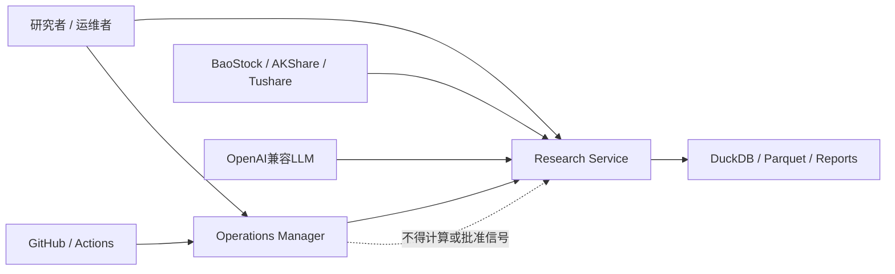
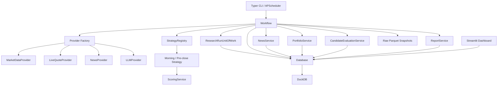
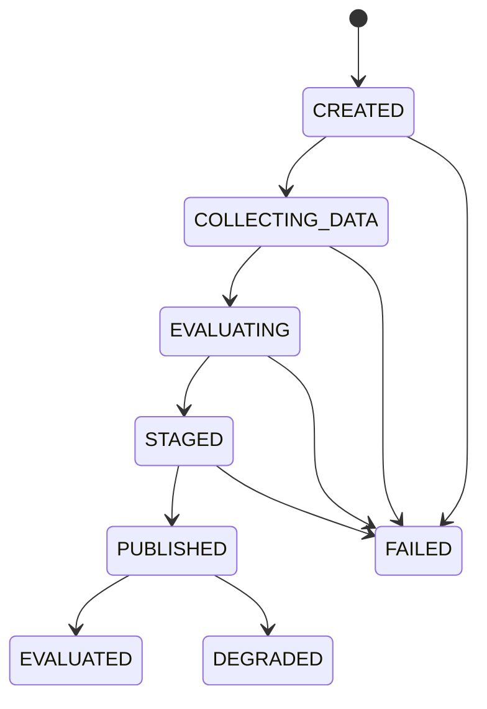

# KFCQuant 技术架构总结与演进路线

> 本文档是 KFCQuant 的长期工程基线，用于回答四个问题：系统现在是什么、为什么这样设计、接下来向哪里演进、每一阶段做到什么程度才算完成。

## 0. 文档控制

| 项目 | 当前值 |
|---|---|
| 文档状态 | Active / 长期维护 |
| 首次建立 | 2026-08-15 |
| 最近复核 | 2026-08-15 |
| 项目版本基线 | `0.2.0` |
| 源码基线 | `5b2c4bd037ef3ac2decb81f1074e0fbc3d4ef6e0`（工作区） |
| 适用范围 | Research Service、Operations Manager、数据与部署基础设施 |
| 目标读者 | 项目维护者、策略开发者、代码审查者、部署维护者 |
| 领域语言 | 以根目录 `CONTEXT.md` 为准 |
| 路线状态来源 | 本文第 12、13 节 |

相关基线文档：

- [项目说明与运行手册](../README.md)
- [领域语言](../CONTEXT.md)
- [项目与依赖声明](../pyproject.toml)
- [生产依赖锁](../requirements.lock)
- [持续集成工作流](../.github/workflows/ci-release.yml)

### 0.1 文档职责

本文档负责：

- 记录当前已实现架构，而不是只描述理想架构；
- 说明关键质量属性、边界和依赖方向；
- 维护架构风险、技术债和演进优先级；
- 把宏观方向拆成可独立验收的工作包；
- 用明确证据记录里程碑完成程度；
- 为后续 ADR、迁移、策略实验和发布决策提供索引。

本文档不负责：

- 取代 `README.md` 的安装和使用说明；
- 取代 `CONTEXT.md` 的领域词汇定义；
- 记录某一策略的全部研究假设和参数；
- 取代数据库迁移文件、API契约或运行手册；
- 将未来路线描述成已经具备的能力。

### 0.2 更新触发条件

发生下列任一事件时，必须在同一个变更中复核本文档：

1. 新增、删除或重命名核心模块；
2. 新增策略、数据源、账户或执行模式；
3. 修改 Signal Run、订单、持仓、评估或数据快照模型；
4. 修改调度窗口、数据新鲜度门禁或降级规则；
5. 修改数据库、迁移方式、并发模型或部署拓扑；
6. 完成或调整本文路线图中的工作包；
7. 发生需要改变架构假设的生产事故；
8. 每个正式版本发布前，至少进行一次例行复核。

### 0.3 状态词汇

本文统一使用以下状态，禁止用“差不多”“基本完成”等模糊表述：

| 状态 | 含义 |
|---|---|
| `NOT_STARTED` | 尚未开始，没有可验收产物 |
| `PLANNED` | 范围和验收条件已明确，尚未编码 |
| `IN_PROGRESS` | 已有实现，但尚未满足全部验收条件 |
| `BLOCKED` | 存在明确阻塞条件，必须记录原因 |
| `DONE` | 全部验收条件通过且证据已登记 |
| `DEFERRED` | 主动延后，必须记录重新评估条件 |
| `REJECTED` | 经决策不再实施，必须记录原因或ADR |

路线进度不按主观百分比填写，统一按已验收工作点计算：

```text
里程碑完成度 = DONE 工作点之和 / 里程碑全部工作点之和
```

工作点只表达相对复杂度：`1`为小、`2`为中小、`3`为中、`5`为大，不代表工时承诺。

---

## 1. 执行摘要

KFCQuant 当前是一个面向个人使用、强调可审计和安全降级的 A 股双时段研究系统。它在 08:30 产生 Morning Watchlist，在 14:40 产生 Pre-close Entry List，维护影子组合并做前向评估；它不连接券商，也不执行真实交易。

当前最准确的架构定性是：

> 一个以 Python、DuckDB 和 Parquet 为基础，采用单一写入者模型，并将 Research Service 与 Operations Manager 分离的单机模块化单体。

当前工程能力分布并不均衡：

| 能力 | 成熟度 | 结论 |
|---|---:|---|
| 运行安全与失败关闭 | 较高 | 数据不新鲜、公告异常和窗口不符时能够禁止影子买单 |
| 数据源隔离 | 中高 | Provider已有Protocol与Factory，测试可注入Fake |
| 影子组合一致性 | 中高 | 买卖成交具备事务和幂等保护 |
| 部署与回滚 | 较高 | 具备CI验证、备份、健康检查和自动回滚 |
| 单策略可维护性 | 中等 | 代码集中、测试较好，但评分职责较多 |
| 多策略演进 | 中低 | Strategy契约与Registry已建立，归属、参数和共享内核仍待完成 |
| 严格可复现性 | 偏低 | 缺少完整Run Manifest、数据版本和Prompt版本 |
| 故障恢复 | 高 | Signal发布已整体原子化；Job具备续租、竞争隔离、过期回收和迟到写入隔离 |
| 可观测性 | 中等 | 有Job、心跳和健康状态，缺少结构化指标与告警 |
| 回放与实验 | 偏低 | 有前向评估，尚无共享策略内核的历史Replay |

最重要的长期演进支点是：

1. 让 Strategy 成为一等架构对象；
2. 让每次 Research Run 拥有完整、不可变的运行清单；
3. 让一次Signal发布成为原子、幂等、可恢复的事务；
4. 让实时运行与历史回放复用同一个策略内核；
5. 保持模块化单体，避免在规模需求出现前引入分布式复杂度。

---

## 2. 系统目标、约束与质量属性

### 2.1 系统目标

- 在明确的信息截止时间内产生可审计的研究信号；
- 对行情、公告、新闻和模型输出进行保守风险控制；
- 维护不接券商的影子组合并保存完整订单和成交记录；
- 通过前向数据评估信号与组合表现；
- 让数据源、策略版本、运行状态和发布版本可观察；
- 在个人可承担的运维复杂度内长期稳定运行。

### 2.2 明确约束

- 当前不连接真实券商，不接受自动实盘执行需求；
- 默认面向单用户、单账户、单机部署；
- 当前数据源包含免费公开源，其稳定性和时间精度有限；
- DuckDB采用单一worker写入，网页只读；
- 资讯LLM不能修改确定性技术评分；
- 所有信号必须遵守信息截止边界，禁止未来数据泄漏；
- 不以历史回测或影子结果承诺未来收益。

### 2.3 质量属性优先级

遇到设计冲突时，按下列顺序取舍：

1. **安全性**：不满足数据与资讯门禁时不创建影子买单；
2. **时间正确性**：任何输入都必须满足Signal Run的信息截止边界；
3. **可审计性**：能够解释运行时使用的数据、策略、规则和证据；
4. **可恢复性**：重复运行、进程崩溃和发布失败不会破坏核心状态；
5. **可复现性**：能够基于原始快照和版本清单重放结果；
6. **可演进性**：策略、Provider、评估和组合规则可以独立变化；
7. **可运维性**：运行、告警、部署、备份和回滚可被观察和验证；
8. **性能**：在全市场日频/分钟级研究规模内满足时间窗口；
9. **开发便利性**：在不牺牲上述属性的前提下降低改动成本。

---

## 3. 领域边界与系统上下文

领域术语以 `CONTEXT.md` 为唯一词汇基线。本文使用以下关键概念：

- **Research Service**：产生Signal Run、维护影子组合和发布研究结果；
- **Signal Run**：针对确定市场时段、截止时间和策略版本的一次可审计评估；
- **Morning Watchlist**：08:30观察信号，不创建影子买单；
- **Pre-close Entry List**：14:40尾盘候选，在全部门禁通过时可创建影子订单；
- **Operations Manager**：观察和管理发布、运行与回滚，不参与信号计算；
- **Release / Deployment / Active Release / Runtime State**：沿用领域词汇表定义。

### 3.1 系统上下文



### 3.2 目标限界上下文

| 上下文 | 当前承载位置 | 目标职责 | 主要输入/输出 |
|---|---|---|---|
| Market Data | `providers/*`、`db.py`、`workflow.py` | 获取、标准化、质量校验、快照与查询 | Security、Calendar、DailyBar、LiveQuote |
| Intelligence | `services/news.py`、`providers/qwen.py` | 文档、实体、事件、证据和风险抽取 | Document、RiskEvent |
| Strategy | `strategy/*`、`services/scoring.py` | 策略身份、输入契约、注册组装、股票池、特征、评分、风险门禁、候选选择 | StrategyContext、StrategyResult |
| Portfolio | `services/portfolio.py`、`db.py` | 订单、成交、现金、仓位、退出策略 | PaperOrder、PaperFill、PaperPosition |
| Evaluation | `services/evaluation.py` | 信号效果和组合效果评估 | CandidateOutcome、OpportunityOutcome |
| Research Run | `services/workflow.py` | 编排一次原子、可恢复、可追踪的运行 | Run Manifest、Signal Run |
| Presentation | `cli.py`、`dashboard.py`、reports | 人机交互与只读展示 | CLI、Web、Markdown Report |
| Operations | `kfcops/*`、`deploy/*` | 发布、回滚、健康和运维审计 | Release、Deployment、Runtime State |

---

## 4. 当前实现架构基线

### 4.1 代码组织

```text
KFCQuantitative/
├── src/kfcquant/                 Research Service
│   ├── providers/                外部数据与LLM适配器
│   ├── services/                 评分、资讯、组合、评估、报告和编排
│   ├── strategy/                 Strategy契约、内置适配器与Registry组装
│   ├── models.py                 跨研究域模型
│   ├── interfaces.py             Provider Protocol
│   ├── policies.py               类型化调度、窗口和候选选择Policy
│   ├── migrations.py             有序、事务化DuckDB迁移Runner
│   ├── unit_of_work.py            Research Run原子发布事务边界
│   ├── db.py                     DuckDB Schema、迁移注册和全部Repository能力
│   ├── scheduler.py              APScheduler任务注册
│   ├── cli.py                    Typer命令入口
│   └── dashboard.py              Streamlit只读研究网页
├── src/kfcops/                   Operations Manager
│   ├── deployment.py             发布、回滚和健康检查
│   ├── store.py                  运维SQLite状态与审计
│   └── web.py                    FastAPI运维页面
├── tests/                        单元与组件测试
├── deploy/                       systemd、Nginx、证书与部署脚本
├── scripts/                      Windows启动和任务注册
├── data/                         本地DuckDB与原始快照，Git忽略
├── reports/                      生成报告，Git忽略
├── runtime/                      锁、心跳与临时运行状态，Git忽略
└── backups/                      数据库备份，Git忽略
```

### 4.2 核心调用关系



### 4.3 主要运行序列

#### Morning Watchlist

```text
08:30触发
→ 校验交易日与时间窗口
→ 同步截止时间前资讯
→ 读取前一交易日日线
→ 校验EOD新鲜度
→ 获取风险事件与未处理公告
→ 运行早盘评分
→ 保存Signal Run和Candidates
→ 不创建Paper Order
```

#### Pre-close Entry List

```text
14:40触发
→ 校验交易日与时间窗口
→ 获取并保存实时快照
→ 校验实时行情新鲜度
→ 同步截止时间前资讯
→ 校验正式日线新鲜度
→ 读取早盘候选连续性
→ 运行尾盘评分与风险阻断
→ 保存Signal Run和Candidates
→ 全部门禁通过时创建Paper Orders
```

#### Paper Fill与退出

```text
14:45捕获区间成交
→ 使用14:40至14:45增量成交额/成交量计算VWAP
→ 应用滑点、佣金、手数和现金约束
→ 事务性写入Fill、Position、Cash和Order状态

交易时段每5分钟监控
→ 强制T+1
→ 检查止损优先、止盈、风险事件、分数退出、最大持有期
→ 事务性关闭仓位并记录结果
```

#### Post-close

```text
20:30触发
→ 同步收盘后资讯
→ 评估Morning Watchlist
→ 评估前一交易日Pre-close Entry List
→ 汇总候选、仓位、现金和入场后事件
→ 使用LLM或降级模板生成报告
```

### 4.4 技术栈

| 层次 | 技术 | 当前用途 |
|---|---|---|
| 语言与包管理 | Python 3.12+、setuptools | `src`布局、wheel构建 |
| 配置与模型 | Pydantic、pydantic-settings | Settings、领域DTO、校验 |
| 数据计算 | pandas、NumPy | 特征、排名和行情计算 |
| 分析存储 | DuckDB | 行情、信号、组合、评估、Job与报告 |
| 原始存储 | Parquet | 行情原始快照 |
| 数据源 | BaoStock、AKShare、Tushare | 历史、实时、公告与新闻 |
| LLM | OpenAI兼容客户端 | 风险事件抽取和报告生成 |
| 调度 | APScheduler | 日历、信号、成交、监控、报告 |
| 研究界面 | Streamlit、Plotly | 候选、组合、评估和健康展示 |
| 运维界面 | FastAPI、Jinja2 | 发布、回滚、状态和审计 |
| CLI | Typer、Rich | 运维与研究命令 |
| 并发保护 | filelock | DuckDB跨进程锁与部署锁 |
| 测试与检查 | pytest、coverage、Ruff | 自动测试、覆盖率和静态检查 |
| CI/CD | GitHub Actions | Python 3.12测试、构建wheel |
| 生产运行 | systemd、Nginx、Certbot | Linux服务、反向代理和证书 |

### 4.5 持久化模型

当前DuckDB主要数据分组：

| 分组 | 表 |
|---|---|
| 市场主数据 | `securities`、`trade_calendar` |
| 行情 | `daily_bars`、`live_quotes` |
| 资讯与风险 | `news_documents`、`risk_events` |
| 信号 | `signal_runs`、`candidate_scores` |
| 影子组合 | `paper_account`、`paper_orders`、`paper_fills`、`paper_positions` |
| 评估 | `candidate_outcomes`、`opportunity_outcomes` |
| 运行与报告 | `job_runs`、`job_leases`、`reports`、`schema_migrations` |

当前存储特点：

- 一个DuckDB文件承载研究读写模型；
- worker是唯一正式写入者，Dashboard以只读模式运行；
- 所有连接使用同一个跨进程文件锁，包括只读连接；
- 候选因子、风险ID和元数据以JSON保存，便于演进但不利于强约束查询；
- 买卖成交已使用显式数据库事务；
- Signal Run具有类型化生命周期，业务查询只消费明确可读终态；
- Signal Run、Candidates、Orders和Job完成状态由Research Run UoW统一事务发布。
- Job租约独立存放于`job_leases`，保持旧版八列`job_runs`写入兼容；有效租约阻止同名竞争与部署，过期任务可在Scheduler启动时幂等回收。
- Morning与Pre-close通过统一Strategy契约和Registry解析；现有`strategy_version_*`配置由内置Strategy Identity承接，持久化Schema保持不变。

### 4.6 部署拓扑

生产环境当前由三个服务组成：

| 服务 | 用户 | 权限与职责 |
|---|---|---|
| `kfcquant-worker` | `kfcquant` | 唯一数据库写入者，运行Scheduler |
| `kfcquant-web` | `kfcquant` | 只读数据库，提供Research Dashboard |
| `kfcops` | `kfcops` | 发布、回滚、健康和受限服务控制 |

发布流程验证目标SHA的GitHub Actions状态，避开受保护交易窗口，停止研究服务，备份DuckDB，安装锁定依赖，迁移、启动并健康检查；失败时尝试恢复上一提交和数据库备份。

---

## 5. 当前工程质量基线

基于2026-08-15本地验证：

| 检查 | 结果 |
|---|---|
| Ruff | 通过 |
| Pytest | 102项通过 |
| 总覆盖率 | 73% |
| `strategy/*` | 100%语句覆盖；阶段专项100%分支覆盖 |
| `services/scoring.py` | 92% |
| `db.py` | 90% |
| `unit_of_work.py` | 100% |
| `models.py` | 98% |
| `services/portfolio.py` | 81% |
| `services/workflow.py` | 60% |
| CLI、Scheduler、Dashboard | 接近0%或未直接覆盖 |

已有测试重点覆盖：

- 主板过滤与确定性评分；
- 过期行情和历史ST状态；
- 硬风险阻断；
- 资讯截止边界；
- 早盘和尾盘信号隔离；
- 模拟成交幂等性；
- T+1和同Bar止损优先；
- 数据库迁移与跨进程锁；
- 免费Provider标准化和降级；
- 运维CSRF、SHA校验、保护窗口和回滚材料。
- Run生命周期合法转换、终态可见性和旧状态迁移；
- Signal Run、Candidates、Orders与Job完成的原子发布及四阶段故障回滚。
- Job租约续期、同名并发竞争、过期回收、迟到发布隔离与部署门禁；评估和报告原子Upsert失败保留旧值。
- Strategy Identity/Context/Result/Protocol、Registry重复/缺项拒绝、两时段Registry注入和版本来源；Morning无买单与blocked Candidate无买单贯穿回归。

尚未形成强保护的区域：

- Scheduler任务重叠与错过恢复；
- Dashboard完整烟雾和数据契约；
- 部署过程中断、依赖半安装和回滚演练；
- Provider真实契约漂移；
- 历史重放与实时信号一致性；
- 结构化日志、指标和告警。

---

## 6. 当前优势与必须保留的设计

后续重构必须保留以下已有能力：

1. **Research与Operations边界**：Operations Manager不能计算、修改或批准研究信号；
2. **失败关闭**：公告源、行情、交易日历或EOD数据不满足门禁时禁止影子买单；
3. **时间边界**：Signal Run只使用information cutoff之前的信息；
4. **确定性技术评分**：LLM不能直接修改技术评分；
5. **LLM证据约束**：不能在原文中定位的证据不得形成硬阻断；
6. **原始快照**：继续保留原始数据以支持审计和重放；
7. **订单与成交幂等性**：重复任务不能重复扣款或重复建仓；
8. **T+1、费用和滑点**：模拟组合不能退化成不现实的理想成交；
9. **单一写入者**：在DuckDB阶段继续保持明确写入所有权；
10. **锁定发布**：只允许部署通过主分支工作流验证的不可变SHA；
11. **数据库备份和自动回滚**：任何新发布机制不得弱化现有恢复能力；
12. **非实盘边界**：新增功能不得隐式扩张到真实券商执行。

---

## 7. 架构问题与技术债台账

严重度定义：

- `CRITICAL`：可能造成错误订单、状态破坏或无法恢复；
- `HIGH`：明显限制正确性、复现或下一阶段演进；
- `MEDIUM`：维护成本或故障定位成本持续增加；
- `LOW`：一致性、体验或工程卫生问题。

| ID | 严重度 | 当前问题 | 影响 | 目标里程碑 | 状态 |
|---|---|---|---|---|---|
| TD-001 | CRITICAL | Signal Run、Candidates、Orders和Job完成分多次提交 | 崩溃后可能出现部分发布状态 | M1 | `DONE` |
| TD-002 | HIGH | `running` Job没有租约和崩溃回收 | stale记录可能长期阻止部署 | M1 | `DONE` |
| TD-003 | HIGH | 迁移逻辑集中在`initialize()`中的即席ALTER | 迁移顺序、失败恢复和兼容边界不清晰 | M1 | `DONE` |
| TD-004 | HIGH | 时间窗口、Top N和部分规则分散硬编码 | 配置漂移和行为不一致 | M1 | `DONE` |
| TD-005 | HIGH | Strategy不是一等接口 | 多策略、实验和Replay需要修改核心编排 | M2 | `DONE` |
| TD-006 | HIGH | 策略版本只是自由字符串 | 无法严格绑定代码、参数和因子定义 | M2 | `NOT_STARTED` |
| TD-007 | HIGH | 缺少完整Run Manifest和数据快照引用 | 不能严格重放历史Signal Run | M3 | `NOT_STARTED` |
| TD-008 | HIGH | Provider以无Schema的DataFrame作为跨层契约 | 外部字段、类型或单位漂移可能静默污染结果 | M3 | `NOT_STARTED` |
| TD-009 | HIGH | 实时与未来历史回放尚无共享执行内核 | 容易形成回测—运行偏差 | M4 | `NOT_STARTED` |
| TD-010 | MEDIUM | `Workflow`和`Database`职责过多 | 改动影响面扩大、测试变重 | M5 | `NOT_STARTED` |
| TD-011 | MEDIUM | 读写共用全局文件锁 | Dashboard和多策略并行扩展受限 | M5/M6 | `NOT_STARTED` |
| TD-012 | MEDIUM | 日志、指标和告警未形成统一体系 | 故障发现和根因定位依赖人工查看 | M5 | `NOT_STARTED` |
| TD-013 | MEDIUM | 部署原地修改工作区和活跃虚拟环境 | pip中断可能留下半更新环境 | M6 | `NOT_STARTED` |
| TD-014 | MEDIUM | 资讯只支持单一`ts_code`归属 | 多实体公告和行业事件表达不足 | M3 | `NOT_STARTED` |
| TD-015 | MEDIUM | LLM Prompt与响应缺少完整版本和追踪元数据 | 风险抽取结果难以复现和比较 | M3 | `NOT_STARTED` |
| TD-016 | LOW | Python要求曾存在3.12/3.13口径差异 | 合法环境可能被doctor误判 | M1 | `DONE` |
| TD-017 | LOW | 缺少覆盖率门槛、类型检查和依赖安全检查 | 质量退化不能在CI中完全阻断 | M5 | `NOT_STARTED` |

技术债状态更新必须附带以下之一：

- 代码与测试证据；
- 迁移或运行验证结果；
- 关联ADR；
- 明确的拒绝或延期理由。

---

## 8. 目标架构原则

### AP-01 保持模块化单体

在出现多用户、多账户、多写入者或远程事务需求之前，不引入微服务、消息总线和分布式事务。模块边界通过依赖方向、接口、Repository和测试实现。

### AP-02 Strategy是一等架构对象

Strategy必须拥有稳定身份、版本、参数、数据需求、输入上下文和结果模型；Workflow不得通过条件分支内置所有策略差异。

### AP-03 实时与Replay共用策略内核

实时运行和历史回放只允许在Clock、数据读取器和成交模拟器上不同；股票池、特征、评分和风险规则必须复用同一实现。

### AP-04 所有Signal Run都可追踪

每次运行必须关联代码SHA、参数Hash、特征版本、数据快照、Provider、Prompt版本、信息截止时间和质量状态。

### AP-05 发布信号是原子操作

外部消费者只能看到完整的Published Run。Run、Candidates和由其产生的Orders必须在统一事务或等价状态机中发布。

### AP-06 默认失败关闭

无法证明数据满足门禁时，系统必须选择不可交易状态；降级报告可以继续生成，但不得绕过风险门禁。

### AP-07 配置只有一个事实来源

调度时刻、窗口、Top N、阈值和策略参数不得在多个模块重复定义。派生时间和规则由类型化Policy对象计算。

### AP-08 边界数据必须显式校验

Provider返回的数据在进入领域逻辑前必须通过列、类型、时区、单位、唯一键、数值范围和截止时间校验。

### AP-09 业务状态优先使用类型和状态机

关键状态不能只依赖自由字符串。状态转换必须可验证，并对重复调用和崩溃恢复有定义。

### AP-10 Operations保持独立可观察

Operations Manager继续独立于研究决策；部署状态和Research Runtime State不得混为一体。

---

## 9. 目标逻辑架构

目标依赖方向：

```text
Presentation → Application → Domain
Infrastructure ─────────────→ Domain-defined ports

Domain不得依赖DuckDB、Streamlit、AKShare、APScheduler或systemd。
```

建议逐步演进为：

```text
src/kfcquant/
├── domain/
│   ├── market/                    市场数据语义与质量规则
│   ├── intelligence/              文档、实体、事件与风险证据
│   ├── strategy/                  Strategy、特征、评分和选择Policy
│   ├── portfolio/                 订单、成交、费用、仓位和退出
│   ├── evaluation/                信号与组合评价
│   └── research_run/              Run状态、Manifest和发布规则
├── application/
│   ├── commands/                  写用例
│   ├── queries/                   只读查询用例
│   ├── ports/                     Repository、Clock和外部服务接口
│   └── unit_of_work.py            事务边界
├── infrastructure/
│   ├── providers/                 BaoStock、AKShare、Tushare、LLM
│   ├── persistence/               DuckDB Repository和迁移
│   ├── scheduling/                APScheduler适配
│   └── observability/             日志、指标和健康
├── presentation/
│   ├── cli.py
│   ├── dashboard.py
│   └── reports.py
└── bootstrap.py                   依赖组装
```

这是一条目标路线，不要求一次性搬动目录。任何拆分必须先有行为测试，再做小步迁移。

### 9.1 目标Strategy契约

```text
StrategyIdentity
├── strategy_id
├── version
├── code_sha
├── parameter_hash
├── feature_schema_version
└── risk_policy_version

StrategyContext
├── run_id
├── signal_kind
├── as_of
├── information_cutoff
├── universe
├── market_snapshot
├── intelligence_snapshot
└── previous_signals

StrategyResult
├── candidates
├── exclusions
├── diagnostics
├── data_requirements_status
└── manifest_fragment
```

### 9.2 目标Research Run状态机



只有`PUBLISHED`或明确定义的可读终态才能成为Dashboard、Portfolio和Evaluation的输入。

### 9.3 目标Run Manifest

```text
ResearchRunManifest
├── run_id、signal_kind、information_cutoff
├── strategy identity与完整参数快照
├── source_sha、项目版本、依赖环境摘要
├── 数据快照ID、Hash、Provider和采集时间
├── 特征Schema与股票池版本
├── 风险词典、Prompt与LLM模型版本
├── 每阶段质量门禁和耗时
└── 最终结果Hash
```

---

## 10. 宏观演进路线


| 里程碑 | 宏观目标 | 完成定义 | 当前状态 |
|---|---|---|---|
| M0 | 固化当前事实和路线治理 | 技术基线、风险台账、路线和验收规则进入仓库 | `DONE` |
| M1 | 保证核心状态正确且可恢复 | Signal发布原子化、Job可回收、配置收口、迁移可验证 | `DONE` |
| M2 | 建立可插拔策略内核 | Strategy契约、策略注册、版本化参数和归属贯穿核心模型 | `NOT_STARTED` |
| M3 | 建立严格数据与模型血缘 | Run Manifest、数据Schema、快照引用、Prompt追踪可查询 | `NOT_STARTED` |
| M4 | 建立实时/历史共核的Replay与实验体系 | 固定快照重放结果一致，可比较基线和候选策略 | `NOT_STARTED` |
| M5 | 降低长期维护和运营成本 | 用例与Repository边界明确，结构化观测和质量门禁完善 | `NOT_STARTED` |
| M6 | 强化发布并基于证据决定扩展 | 原子Release、恢复演练通过，数据库扩展有量化门槛 | `NOT_STARTED` |

推荐顺序不是简单的代码美化顺序。M1先保护正确性，M2再释放策略演进能力，M3和M4建立研究可信度，M5和M6最后解决规模化维护问题。

---

## 11. 微观路线与工作包

### M0：架构基线与治理

| ID | 工作包 | 点数 | 验收标准 | 状态 | 证据 |
|---|---|---:|---|---|---|
| M0-01 | 建立长期技术总结 | 2 | 包含现状、目标、技术债、路线、验收和维护规则 | `DONE` | `doc/KFCQ_TechnicalSummary.md` |
| M0-02 | 验证当前质量基线 | 1 | Ruff通过、38项测试通过、覆盖率已记录 | `DONE` | 2026-08-15本地验证 |
| M0-03 | 固化领域语言引用 | 1 | 文档明确以`CONTEXT.md`为领域词汇来源 | `DONE` | 本文第3节 |

M0进度：`4 / 4 = 100%`

### M1：正确性、原子性与恢复

| ID | 工作包 | 点数 | 主要交付物 | 验收标准 | 状态 |
|---|---|---:|---|---|---|
| M1-01 | Research Run Unit of Work | 5 | UoW接口和DuckDB实现 | 故障注入证明不会暴露部分Published Run | `DONE` |
| M1-02 | Run状态机 | 3 | 类型化状态与迁移规则 | 非法转换被拒绝；Dashboard只读允许终态 | `DONE` |
| M1-03 | Job租约与崩溃回收 | 3 | `heartbeat_at`、`lease_expires_at`、回收流程 | worker崩溃后过期Job不再永久阻塞部署 | `DONE` |
| M1-04 | 原子Upsert | 2 | 替换DELETE+INSERT路径 | 中途失败不丢失旧评估或报告 | `DONE` |
| M1-05 | 正式迁移框架 | 3 | 有序、幂等迁移与迁移测试 | 空库、旧库、重复执行、失败恢复均通过 | `DONE` |
| M1-06 | Schedule与Selection配置收口 | 3 | 类型化Policy | 时间窗口、调度、Top N不再多处硬编码 | `DONE` |
| M1-07 | 启动配置校验 | 2 | Research/Ops配置验证 | 默认secret、矛盾时间、无效比例和版本要求被拒绝 | `DONE` |
| M1-08 | Python版本口径统一 | 1 | 代码、CI、文档一致 | Python 3.12合法环境通过doctor | `DONE` |

M1进度：`22 / 22 = 100%`。

- M1-01证据：`ResearchRunUnitOfWork` Protocol与DuckDB实现将Run、Candidates、Orders和Job终态置于单一事务；Run/Candidates/Orders/Job四个注入点均全量回滚；工作流中断后无部分可见数据，安全重试产生一份完整发布；相同发布重复提交幂等，冲突发布被拒绝。
- M1-02证据：Research Run生命周期与转换表已类型化；非法转换被拒绝；业务查询和Dashboard只读取Published或明确定义的可读终态；Schema v3完成旧`success/degraded/running/failed/missed`映射并保持旧发布写入兼容。
- M1-03证据：Schema v4通过独立`job_leases`表记录心跳、到期时间和回收次数，保持旧版八列`job_runs`写入兼容；关键阶段续租、同名线程竞争仅一方获取租约、过期回收幂等、迟到完成和迟到Run发布均被拒绝；Scheduler启动恢复、Operations有效/过期/不可验证租约门禁通过。
- M1-04证据：OpportunityOutcome、CandidateOutcome和Report的`DELETE+INSERT`已替换为按自然键冲突处理的单语句Upsert；正常更新与重复保存通过，主键/自然键交叉冲突时旧行完整保留。
- M1-05证据：正式迁移注册表与逐迁移事务Runner已替代`initialize()`即席ALTER；空库初始化、旧`signal_runs`升级、重复执行、中途SQL失败回滚、修复后恢复均通过；M1-A验收时Schema版本为2，本阶段经同一Runner有序升至3并保持旧发布写入兼容。
- M1-06证据：Schedule/Selection Policy驱动Workflow窗口、APScheduler、Windows任务注册、候选存储、早盘连续性、订单、评估、报告和Dashboard；非默认14:30场景贯穿调度计划、运行门禁、3个持久化候选与2个订单。
- M1-07证据：Pydantic启动校验覆盖默认/短Ops secret、保护窗口、Research任务时序、Provider、Tushare Token、费用、仓位比例、候选上限和策略版本格式；Research/Ops各入口共享同一Settings校验。
- M1-08证据：Python 3.12、3.13和3.11边界测试通过；Windows启动器、项目声明、CI、依赖锁、README和Linux bootstrap版本契约测试通过。

M1完成条件已满足：全部工作包`DONE`，Signal发布中断、Job崩溃恢复、并发租约和原子更新故障场景均通过。

### M2：策略内核与多策略基础

| ID | 工作包 | 点数 | 主要交付物 | 验收标准 | 状态 |
|---|---|---:|---|---|---|
| M2-01 | Strategy契约 | 3 | Identity、Context、Result、Protocol | Morning与Pre-close可通过统一契约调用 | `DONE` |
| M2-02 | 股票池Policy | 3 | UniversePolicy | 主板、ST、上市时间、停牌和流动性规则独立测试 | `NOT_STARTED` |
| M2-03 | 特征流水线 | 5 | FeaturePipeline与FeatureSchema | 特征计算不负责新闻、风险和排序 | `NOT_STARTED` |
| M2-04 | 评分与风险分离 | 5 | ScoreModel、RiskPolicy | 技术分、资讯调整和硬阻断可独立测试 | `NOT_STARTED` |
| M2-05 | SelectionPolicy | 2 | Top N、阈值和排序规则 | Workflow、Portfolio、Evaluation共用同一Policy | `NOT_STARTED` |
| M2-06 | 策略Registry与依赖注入 | 3 | StrategyRegistry、bootstrap组装 | 新增策略不修改Workflow主体分支 | `DONE` |
| M2-07 | 策略归属贯穿模型 | 5 | `strategy_id`进入Run、Order、Position、Outcome | 任一成交与评估可追溯到具体策略 | `NOT_STARTED` |
| M2-08 | 参数快照与Hash | 3 | 规范化参数序列化 | 同一Hash代表同一参数；变更自动产生新Hash | `NOT_STARTED` |
| M2-09 | Golden Snapshot测试 | 3 | 固定输入与输出基线 | 非预期候选或分数变化会使CI失败 | `NOT_STARTED` |

M2进度：`6 / 32 = 18.8%`。完成条件：至少两套Strategy实现可共存，且不复制Workflow。

- M2-01证据：新增类型化且不可变的Strategy Identity、Requirements、Context与Result，以及统一Protocol；Context拒绝无时区和晚于`as_of`的信息截止时间；Morning与Pre-close内置适配器均通过`evaluate(context)`调用现有确定性评分，阶段专项语句与分支覆盖率均为100%。
- M2-06证据：StrategyRegistry按Signal Kind显式组装，重复注册、缺失注册和跨Signal Context均明确失败；Workflow启动要求两种Signal实现，通过注入版本不同的Registry完成Morning与Pre-close离线贯穿，持久化Run版本来自Registry Identity，新增/替换实现不需修改Workflow主体；既有原子发布、无买单门禁和配置兼容回归通过。

### M3：数据契约、血缘与LLM治理

| ID | 工作包 | 点数 | 主要交付物 | 验收标准 | 状态 |
|---|---|---:|---|---|---|
| M3-01 | 表级数据Schema | 5 | Security、Calendar、DailyBar、Quote Schema | 列、类型、时区、单位、唯一键和数值关系可验证 | `NOT_STARTED` |
| M3-02 | Provider契约测试套件 | 3 | 所有Provider共享的contract tests | 新Provider必须通过同一规范化契约 | `NOT_STARTED` |
| M3-03 | Ingestion Manifest | 5 | Provider、采集时间、Hash、行数、质量报告 | 任一规范化批次可追溯到原始输入 | `NOT_STARTED` |
| M3-04 | Run Manifest | 5 | 运行清单模型与持久化 | 任一Published Run包含全部必要版本与快照引用 | `NOT_STARTED` |
| M3-05 | 时间边界守卫 | 3 | Point-in-time Data Gateway | 截止时间后的数据无法进入StrategyContext | `NOT_STARTED` |
| M3-06 | Provider身份去硬编码 | 1 | 快照使用实际Provider元数据 | 切换Live Provider后血缘名称正确 | `NOT_STARTED` |
| M3-07 | LLM调用追踪 | 3 | Prompt版本、Hash、模型、耗时、失败信息 | 风险事件可追溯到抽取配置和输入Hash | `NOT_STARTED` |
| M3-08 | 多实体资讯模型 | 5 | DocumentEntity、RiskEventEntity关系 | 一篇文档可关联多证券且保留相关度 | `NOT_STARTED` |

M3总点数：`30`。完成条件：选取任一历史Run，可定位其所有策略、数据和LLM输入版本。

### M4：Replay与策略实验

| ID | 工作包 | 点数 | 主要交付物 | 验收标准 | 状态 |
|---|---|---:|---|---|---|
| M4-01 | Clock抽象 | 2 | SystemClock、ReplayClock | Strategy和用例不直接依赖`datetime.now()` | `NOT_STARTED` |
| M4-02 | Replay数据读取器 | 5 | 基于Manifest/快照的Data Gateway | 严格只返回截止时间前的数据 | `NOT_STARTED` |
| M4-03 | 共核Replay Runner | 5 | 复用正式Strategy的重放入口 | 同一快照实时路径与Replay路径输出Hash一致 | `NOT_STARTED` |
| M4-04 | 历史成交模拟器 | 5 | 与实时影子成交分离的Simulator | 费用、滑点、T+1和不可成交规则显式配置 | `NOT_STARTED` |
| M4-05 | Experiment模型 | 5 | 假设、基线、候选、数据集、标准、结论 | 策略变更有可审计实验记录 | `NOT_STARTED` |
| M4-06 | 评估指标体系 | 5 | 信号、组合和数据质量指标 | 包含分层收益、MFE/MAE、回撤、换手和可评估率 | `NOT_STARTED` |
| M4-07 | 防未来函数测试 | 3 | 时间扰动和属性测试 | 添加截止时间后数据不会改变既有Run结果 | `NOT_STARTED` |

M4总点数：`30`。完成条件：候选策略必须能与基线策略在同一不可变数据集上比较。

### M5：模块化、可观测性与质量门禁

| ID | 工作包 | 点数 | 主要交付物 | 验收标准 | 状态 |
|---|---|---:|---|---|---|
| M5-01 | Workflow拆为应用用例 | 5 | 独立Command/Query用例 | 单个用例不拥有无关职责 | `NOT_STARTED` |
| M5-02 | Database拆为Repository | 5 | 按上下文拆分接口与实现 | 服务只获得最小所需持久化能力 | `NOT_STARTED` |
| M5-03 | 依赖组装入口 | 3 | `bootstrap.py`或等价Composition Root | 领域和用例不自行构造基础设施 | `NOT_STARTED` |
| M5-04 | 结构化日志 | 3 | JSON日志与关联ID | Job、Run、Strategy、Provider和阶段可串联查询 | `NOT_STARTED` |
| M5-05 | 指标与告警 | 5 | 运行、数据、锁、LLM和组合指标 | 14:40失败、心跳丢失和资讯异常可主动通知 | `NOT_STARTED` |
| M5-06 | Dashboard Query Model | 3 | 只读投影或物化查询 | 页面不直接拼接全部领域表语义 | `NOT_STARTED` |
| M5-07 | CI质量门禁 | 3 | 覆盖率阈值、类型检查、安全扫描 | 质量退化和已知高危依赖能阻断合并 | `NOT_STARTED` |
| M5-08 | 故障注入测试 | 5 | 数据源、锁、崩溃和恢复场景 | 关键故障路径具有自动化证据 | `NOT_STARTED` |

M5总点数：`32`。完成条件：核心模块边界可由接口和CI验证，而不只是目录约定。

### M6：发布强化与规模决策

| ID | 工作包 | 点数 | 主要交付物 | 验收标准 | 状态 |
|---|---|---:|---|---|---|
| M6-01 | 版本目录与原子切换 | 5 | `releases/<sha>`、独立venv、`current`链接 | 构建失败不污染Active Release | `NOT_STARTED` |
| M6-02 | 迁移预检与兼容矩阵 | 3 | 发布前检查和回滚兼容说明 | 不可安全回滚的迁移必须被显式阻止或批准 | `NOT_STARTED` |
| M6-03 | 备份恢复演练 | 3 | 定期恢复测试记录 | 备份不仅存在，而且可恢复并通过健康检查 | `NOT_STARTED` |
| M6-04 | 供应链治理 | 3 | 依赖审计、secret扫描、构建来源记录 | Release可追踪依赖与构建证据 | `NOT_STARTED` |
| M6-05 | 性能与锁基线 | 3 | Run耗时、锁等待、查询耗时基线 | 有数据支持是否继续使用DuckDB | `NOT_STARTED` |
| M6-06 | 扩展决策门槛 | 1 | PostgreSQL/队列引入标准 | 不基于主观感受引入分布式组件 | `NOT_STARTED` |

M6总点数：`18`。完成条件：发布环境可原子切换，并对是否扩展存储和并发架构形成证据化决策。

---

## 12. 路线进度总表

> 本表是路线完成度的唯一汇总入口。工作包状态变化后必须同步更新点数和最近证据。

| 里程碑 | DONE点数 | 总点数 | 完成度 | 状态 | 最近证据 |
|---|---:|---:|---:|---|---|
| M0 架构基线与治理 | 4 | 4 | 100% | `DONE` | 2026-08-15建立本文档并验证现有测试 |
| M1 正确性、原子性与恢复 | 22 | 22 | 100% | `DONE` | 2026-08-15完成M1-C；93项测试、Ruff、Job崩溃/竞争恢复、原子Upsert、迁移兼容和pip check通过 |
| M2 策略内核与多策略基础 | 6 | 32 | 18.8% | `IN_PROGRESS` | 2026-08-15完成M2-A；102项测试、Strategy分支覆盖率100%、Ruff和Registry两时段贯穿通过 |
| M3 数据契约、血缘与LLM治理 | 0 | 30 | 0% | `NOT_STARTED` | — |
| M4 Replay与策略实验 | 0 | 30 | 0% | `NOT_STARTED` | — |
| M5 模块化、可观测性与质量门禁 | 0 | 32 | 0% | `NOT_STARTED` | — |
| M6 发布强化与规模决策 | 0 | 18 | 0% | `NOT_STARTED` | — |
| **总体** | **32** | **168** | **19.0%** | `IN_PROGRESS` | M0与M1完成，M2-A完成；下一阶段M2-B |

### 12.1 当前建议的下一工程阶段

工作包仍是最小验收单元；工程阶段是连续推进任务和`/goal`的默认停止单元。M1阶段已全部完成；M2按依赖和共同目标从契约与注册底座开始：

| 阶段ID | 阶段名称 | 工作包 | 点数 | 依赖 | 状态 | 阶段验收目标 |
|---|---|---|---:|---|---|---|
| M1-A | 配置与迁移底座 | M1-06、M1-07、M1-05 | 8 | M1-08 | `DONE` | 配置只有一个事实来源；非法启动配置被拒绝；迁移在空库、旧库、重复执行和失败恢复场景通过 |
| M1-B | Run状态与原子发布 | M1-02、M1-01 | 8 | M1-A | `DONE` | Run状态转换受控；故障注入证明外部不会看到部分Published Run |
| M1-C | 崩溃回收与原子更新 | M1-03、M1-04 | 5 | M1-B | `DONE` | 过期Job可回收；中途失败不丢失旧评估或报告；M1中断恢复场景通过 |
| M2-A | Strategy契约与注册底座 | M2-01、M2-06 | 6 | M1 | `DONE` | Morning与Pre-close通过统一Strategy契约和Registry组装；新增Strategy实现不修改Workflow主体分支 |
| M2-B | 股票池与特征流水线 | M2-02、M2-03 | 8 | M2-A | `NOT_STARTED` | 股票池规则可独立测试；类型化特征流水线不负责新闻、风险和排序；两时段Strategy保持现有候选结果 |

`M1-A`已完成，阶段验收证据为：非默认Schedule/Selection从注册计划贯穿Pre-close运行与订单选择；空库、旧库、重复迁移、失败回滚与恢复通过；Ruff、60项全量测试、66%总覆盖率、pip check和PowerShell语法检查通过。

`M1-B`已完成，阶段验收证据为：Run生命周期合法/非法转换、终态读取边界与五类旧状态升级通过；Pre-close离线端到端在一个事务发布Run、Candidates、Orders和Job终态；四阶段故障注入均无部分可见数据且中断后可安全重试；Morning仍不创建买单，非交易Run与blocked Candidate的买单被拒绝；Ruff、83项全量测试、71%总覆盖率和pip check通过。

`M1-C`已完成，阶段验收证据为：Schema v4空库、旧库、重复执行、中途失败和恢复通过，且旧版八列`job_runs`写入兼容；续租阻止有效Job被回收，两个线程竞争同名任务只产生一个租约；过期Job幂等失败回收后可安全重跑，迟到Job完成和Research Run发布均被隔离；Operations仅让有效或不可验证租约阻止部署；三类评估/报告Upsert正常更新、重复保存和冲突失败保留旧值通过。Ruff、93项全量测试和Research Service 71%总覆盖率通过，`db.py`为90%、`unit_of_work.py`为100%。该阶段完成时建议的后续阶段为`M2-A`，顺序为M2-01 → M2-06，且不在该阶段顺手拆分全部特征或评分职责。

`M2-A`已完成，阶段验收证据为：Morning与Pre-close均从StrategyRegistry解析统一Protocol并通过不可变、带information cutoff的StrategyContext执行；注入与配置不同版本的实现后，两种Signal Run均记录Registry Identity版本，证明替换Strategy不修改Workflow主体；重复/缺失注册和跨Signal Context失败关闭；Morning不创建订单、blocked Candidate和`tradable=false` Run不创建买单、M1-B原子发布与故障重试回归通过。Ruff、102项全量测试、73%总覆盖率、Strategy包100%语句/分支覆盖率和pip check通过。无Schema、迁移、依赖或部署变化；README与领域语言未变化。当前建议的下一工程阶段为`M2-B`，顺序为M2-02 → M2-03；不得在该阶段顺手拆分评分与风险或引入参数Hash。

### 12.2 阶段级Goal执行规则

- 一个工程阶段通常包含同一里程碑内2至4个目标一致、依赖连续的工作包，建议规模为5至10点；不可分割的单一大工作包可以独立成阶段；
- 优先恢复`IN_PROGRESS`阶段，否则选择依赖已满足、顺序最靠前的`NOT_STARTED`阶段；
- 阶段内一个工作包达到`DONE`后应记录证据并继续下一个依赖已满足的工作包，不得仅因单包完成而结束Goal；
- 默认不得跨越当前工程阶段或里程碑；确有不可分割的前置工作时，必须在编码前说明并把它纳入阶段范围；
- 如果路线尚未定义阶段，应在编码前把相邻工作包组织成满足上述规模的阶段，记录阶段ID、范围、依赖和验收目标；
- 只有整个阶段满足第13.3节的完成规则时，阶段级Goal才能结束；
- 阶段级Goal执行时以调用方提供的完整执行契约为准，并将实际证据回写本文。

---

## 13. 工作包完成规则

### 13.1 Definition of Ready

工作包进入`IN_PROGRESS`前必须满足：

- 问题、范围和非目标明确；
- 验收标准可自动或人工验证；
- 已识别涉及的数据迁移和兼容影响；
- 已识别对时间边界、订单安全和回滚的影响；
- 依赖工作包已经完成或明确允许并行；
- 大型或难以逆转决策已判断是否需要ADR。

### 13.2 Definition of Done

工作包只能在同时满足以下条件后标为`DONE`：

1. 实现已进入当前目标工作区；若任务明确授权提交或合并，则已进入目标分支；未授权时须记录未提交状态；
2. 单元、组件或故障场景测试通过；
3. Ruff和项目测试通过；
4. 新状态和Schema具有迁移与兼容验证；
5. 关键行为具有运行日志或指标；
6. README、本文档、CONTEXT或运行手册按需更新；
7. 验收证据已写入工作包或变更记录；
8. 不降低失败关闭、时间边界、幂等性和回滚能力。

### 13.3 工程阶段完成与Goal停止规则

工程阶段只能在同时满足以下条件后标为`DONE`，阶段级Goal也只能在此时正常结束：

- 阶段内全部工作包均为`DONE`，或存在有依据且不破坏阶段目标的`REJECTED`决策；
- 每个工作包的验收证据已登记，阶段级端到端或故障场景通过；
- Ruff、全量项目测试、相关覆盖率和所有适用专项检查通过；
- Schema、迁移、运行流程、依赖或恢复能力的专项验证已按适用范围完成；
- git diff和最终工作区已复核，没有无关改动、敏感信息、生成物或调试残留；
- 本文档已更新工作包与阶段状态、点数、技术债、验证证据、变更记录和下一建议阶段；
- 一个工作包完成只是阶段内检查点，不是阶段级Goal的停止条件；
- 只有确实需要产品决策、破坏性操作、外部权限、密钥或范围扩张时，才允许以`BLOCKED`停止并请求用户决策。

### 13.4 里程碑完成规则

里程碑标为`DONE`必须满足：

- 该里程碑全部工作包为`DONE`或有经记录的`REJECTED`决策；
- 里程碑端到端场景通过；
- 已完成一次面向真实数据副本的演练；
- 没有未说明的CRITICAL/HIGH回归；
- 本文档的进度总表和变更记录已更新。

---

## 14. 测试与验证策略

### 14.1 测试层次

| 层次 | 目标 | 典型对象 |
|---|---|---|
| 纯单元测试 | 验证无I/O领域规则 | 因子、费用、状态机、Policy |
| 契约测试 | 验证边界输入输出 | Provider、Repository、LLM结构化结果 |
| 组件测试 | 验证一个用例和真实DuckDB | Signal发布、成交、迁移 |
| Golden测试 | 防止非预期策略漂移 | 固定Snapshot到Candidates |
| 属性测试 | 验证不变量 | 非负现金、分数范围、禁止未来信息 |
| 故障注入 | 验证恢复与原子性 | 崩溃、超时、锁、半失败 |
| 部署演练 | 验证发布和回滚 | 新Release、数据库备份恢复 |
| 前向验证 | 验证真实运行表现 | Morning与Pre-close长期样本 |

### 14.2 必须长期成立的不变量

- `blocked=true`的Candidate不能创建买单；
- `tradable=false`的Run不能创建买单；
- Signal不能读取`information_cutoff`之后的数据；
- 同一Paper Order最多产生一个Fill；
- Paper Account现金不得因事务中断成为部分更新状态；
- 当日新开仓不得当日卖出；
- Operations Manager不得计算或修改Candidate；
- LLM不能直接改变确定性技术评分；
- 没有可定位原文证据的LLM事件不得形成硬阻断；
- Published Run必须同时拥有完整Candidates和Manifest；
- 同一Snapshot、Strategy Identity和参数必须产生确定性结果。

---

## 15. 可观测性目标

### 15.1 统一关联字段

所有核心日志和指标应尽可能携带：

```text
job_run_id
signal_run_id
strategy_id
strategy_version
source_sha
provider
stage
information_cutoff
```

### 15.2 最小指标集

```text
job_duration_seconds
job_success_total
job_failed_total
job_missed_total
provider_request_duration_seconds
provider_failure_total
quote_age_seconds
latest_eod_lag_days
official_news_pending
llm_extraction_failure_total
candidate_count
order_rejection_total
database_lock_wait_seconds
worker_heartbeat_age_seconds
```

### 15.3 最小告警集

- worker心跳超过阈值；
- 交易日14:40 Signal Run失败或缺失；
- 正式日线连续未更新；
- 官方公告源异常；
- 未处理官方公告持续积压；
- Job租约过期；
- 数据库锁持续超时；
- 备份或恢复验证失败；
- Deployment进入`manual_intervention_required`。

---

## 16. 安全、隐私与供应链

当前必须继续保持：

- 密钥仅进入环境变量或本地忽略文件；
- 数据库、原始快照、报告和日志不得持久化API Key；
- 运维写操作使用CSRF和显式确认；
- 生产服务使用独立系统用户、最小写目录和systemd沙箱；
- 发布目标必须是通过主分支工作流的40位Git SHA；
- 交易保护窗口内不得直接部署或回滚。

后续补强：

- 生产环境拒绝默认`session_secret`；
- CI加入secret扫描和依赖漏洞检查；
- Release记录依赖清单与构建证据；
- 日志脱敏覆盖Bearer Token、URL查询参数和常见授权头；
- 外部文档下载限制协议、重定向、大小、内容类型和内网地址访问；
- LLM输入输出保存Hash和元数据时，不复制不必要的敏感内容。

---

## 17. 性能与扩展决策门槛

当前不因为“可能扩展”而提前替换DuckDB或引入分布式系统。首先记录：

- 全市场数据同步耗时；
- 08:30和14:40端到端运行耗时；
- 数据库锁等待P50/P95/P99；
- Dashboard查询耗时；
- 数据库和Parquet增长率；
- 多策略串行运行总耗时；
- 备份和恢复耗时。

满足以下任一情况时，才正式评估PostgreSQL或任务队列：

1. 出现多个必要的并发写入者；
2. 单机锁等待导致关键Signal窗口无法满足；
3. 出现多用户、多账户或远程事务API；
4. 单一worker无法在截止时间内完成必要策略；
5. DuckDB文件备份和恢复时间超过可接受恢复目标；
6. 已有监控数据证明问题来自存储并发，而不是查询或批处理实现。

任何扩展决策必须记录：问题证据、备选方案、迁移成本、回滚方案和不采用其他方案的原因。

---

## 18. 文档与决策治理

### 18.1 文档关系

| 文档 | 职责 |
|---|---|
| `README.md` | 安装、运行、部署和用户入口 |
| `CONTEXT.md` | 无实现细节的领域词汇表 |
| `doc/KFCQ_TechnicalSummary.md` | 当前架构、目标路线、技术债和进度 |
| 后续运行手册 | 故障处理、备份恢复、告警与值守 |
| 后续策略说明 | 单个策略的假设、因子、参数和实验结果 |
| 后续ADR | 难以逆转且存在真实权衡的架构决策 |

### 18.2 ADR触发标准

只有同时满足以下条件才建立ADR：

1. 决策难以逆转；
2. 缺少上下文时，未来维护者会困惑；
3. 存在真实备选方案和取舍。

可能需要ADR的未来决策包括：

- Strategy插件模型及版本兼容规则；
- DuckDB迁移到PostgreSQL；
- 订单与现金是否采用事件账本；
- 原始数据不可变存储和保留周期；
- 原子Release目录结构；
- 多策略共享账户还是独立账户。

### 18.3 变更记录格式

每次更新在下表追加一行：

| 日期 | 源码版本 | 变更范围 | 路线影响 | 验证证据 |
|---|---|---|---|---|
| 2026-08-15 | `590a4fcee703` | 建立架构基线、技术债、M0-M6路线和进度规则 | M0完成，总体4/168点 | Ruff通过；38项测试通过 |
| 2026-08-15 | `590a4fcee703`（工作区） | 统一Python 3.12+版本口径并增加跨入口契约测试 | M1-08与TD-016完成；M1为1/22点；总体5/168点 | Ruff通过；42项测试通过；总覆盖率64%；pip check与PowerShell语法检查通过 |
| 2026-08-15 | `590a4fcee703`（工作区） | 增加阶段级Goal治理、M1-A至M1-C分组和可复用推进提示词 | 路线点数不变；Goal默认停止单元由单工作包调整为工程阶段 | 文档结构、阶段点数、依赖、相对链接和工作区diff复核通过 |
| 2026-08-15 | `d41577776d8c`（工作区） | 完成M1-A：调度/选择Policy、Research/Ops启动校验、正式迁移Runner | M1-05/06/07、TD-003/004完成；M1为9/22点；总体13/168点；下一阶段M1-B | Ruff通过；60项测试通过；总覆盖率66%；迁移五类场景、阶段贯穿场景、pip check与PowerShell语法通过 |
| 2026-08-15 | `d41577776d8c`（工作区） | 完成M1-B：Run状态机与Research Run原子发布UoW | M1-01/02、TD-001完成；M1为17/22点；总体21/168点；下一阶段M1-C | Ruff通过；83项测试通过；总覆盖率71%；UoW 100%；四阶段故障回滚、重试、迁移兼容与pip check通过 |
| 2026-08-15 | `a6403123bad2`（工作区） | 完成M1-C：Job租约、崩溃回收、迟到写入隔离与评估/报告原子Upsert | M1-03/04、TD-002完成；M1为22/22点；总体26/168点；下一阶段M2-A | Ruff通过；93项测试通过；Research覆盖率71%；DB 90%、UoW 100%；Schema v4五类场景、线程竞争、崩溃恢复、部署门禁、Upsert故障保留和pip check通过 |
| 2026-08-15 | `5b2c4bd037ef`（工作区） | 完成M2-A：Strategy统一契约、内置适配器、Registry与Workflow注入 | M2-01/06、TD-005完成；M2为6/32点；总体32/168点；下一阶段M2-B | Ruff通过；102项测试通过；总覆盖率73%；Strategy语句/分支覆盖率100%；两时段Registry贯穿、安全门禁、原子发布回归和pip check通过 |

---

## 19. 当前结论

KFCQuant当前不是混乱的脚本集合，而是边界意识较强、具备运行和发布闭环的研究应用。它最值得保留的是安全降级、时间边界、影子成交约束和Research/Operations隔离。

下一阶段不应优先追求更多页面、更多Provider或更多策略数量，而应先建立承载这些变化的工程底座：

1. M1解决原子性、恢复和配置一致性；
2. M2让Strategy成为一等对象；
3. M3让每次Run具备严格数据与模型血缘；
4. M4用同一内核支持Replay与实验；
5. M5降低模块耦合并建立主动观测；
6. M6在真实指标证明需要时强化发布和扩展基础设施。

M1已经完成，核心状态具备原子发布、租约回收、迁移兼容和配置一致性保护；M2-A已建立Strategy契约与注册底座，下一步进入M2-B独立股票池与特征流水线，但在M2和M3完成前仍不宜大规模并行增加策略。完成M4后，系统才具备完整实验闭环。
